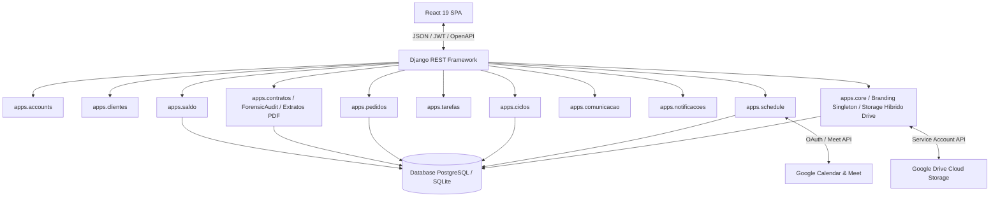
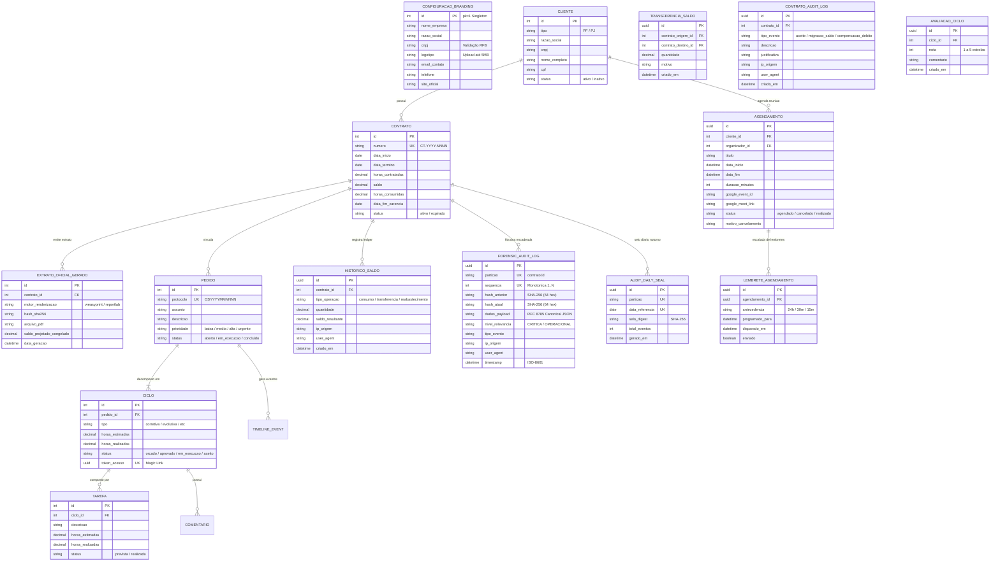
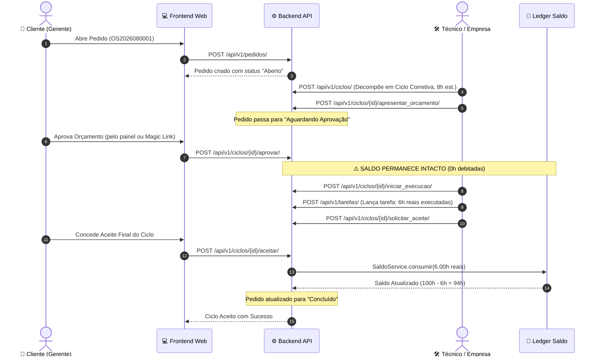
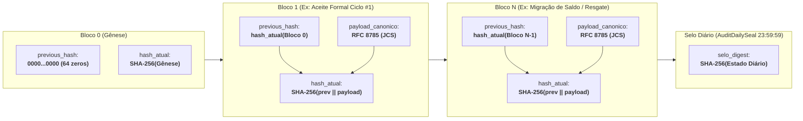
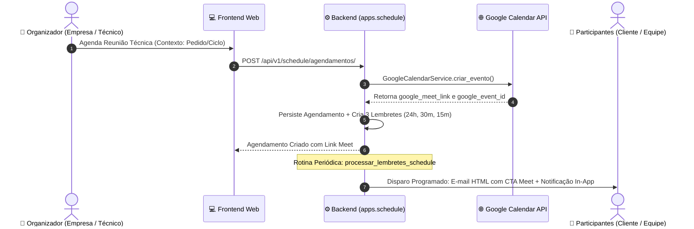

# 🏛️ Documento de Arquitetura do SHM 2.6 (Main Release 2.6 — Branding Corporativo & Governança Forense)

## 1. Visão Geral e Princípios Arquiteturais

O SHM 2.6 foi concebido seguindo os princípios de **Clean Architecture**, **Domain-Driven Design (DDD)** modular no Django e uma separação estrita entre o cliente Frontend (SPA) e a API Backend RESTful.

---

## 2. Modelagem de Dados & ERD

---

## 3. Diagrama de Sequência: Ciclo de Atendimento & Débito no Aceite

---

## 4. Trilha de Auditoria Forense "DNA do Contrato" (Hash Chaining RFC 8785 / SHA-256)

A arquitetura de auditoria do SHM opera sob o conceito da **Fita de DNA Transacional**, onde cada contrato vigente possui sua própria partição contínua (`contrato:<id>`) garantindo imutabilidade matemática absoluta:

### Mecanismos de Blindagem Forense:
1. **Lock Pessimista por Partição (`select_for_update`):** Impede condições de corrida e bifurcações concorrentes na cadeia.
2. **Normalização RFC 8785 (JCS):** Garante ordenação lexicográfica e formatação decimal invariante, permitindo reprodutibilidade em qualquer linguagem.
3. **Gatilho Nativo PostgreSQL (`trg_forensic_audit_immutability`):** Rejeita operações de `UPDATE` e `DELETE` no motor do banco de dados.
4. **Selo Diário Noturno (`AuditDailySeal`):** Lavratura consolidada à meia-noite via `audit_seal_daily`.
5. **Timeline no Extrato (`TimelineAuditoriaContrato`):** Visualização ponto a ponto no frontend.

---

## 5. Módulo Schedule: Agendamento Técnico & Integração Google Meet

O módulo `apps.schedule` centraliza o alinhamento síncrono da equipe técnica com o cliente contratante:

---

## 6. Documentação Pericial Oficial e Soberania Sem Caixa-Preta

Em consonância com a norma **ISO/IEC 27037** e a disciplina legal de **Cadeia de Custódia (CPP arts. 158-A a 158-F)**, o SHM disponibiliza:
- **Rota Pública Aberta:** [`/publico/auditoria-forense`](frontend/src/pages/DocumentacaoAuditoriaPage.tsx) para consulta de peritos judiciais e forças policiais sem login corporativo.
- **Utilitário Pericial Offline em Python Puro:** [`verificador_independente.py`](frontend/src/utils/verificador_script.ts) sem dependências externas (`pip`), projetado para análise pericial em estações *air-gapped*.
- **Comandos de Gerenciamento CLI:** `python manage.py audit_verify_integrity` e `python manage.py audit_seal_daily`.

---

## 7. Segurança & Controle de Acesso (RBAC)

O SHM 2.6 implementa 4 níveis de perfis de acesso:
1. **`EMPRESA_ADMIN`**: Acesso irrestrito a todos os clientes, gestão financeira de contratos, reabastecimentos, transferências e configuração de equipe.
2. **`EMPRESA_TECNICO`**: Acesso à fila operacional, triagem de pedidos, emissão de orçamentos, apontamento de tarefas e agendamento de reuniões técnicas.
3. **`CLIENTE_GERENTE`**: Tomador do contrato. Possui permissão para autorizar orçamentos, aprovar/recusar aceites finais, visualizar extratos financeiros e solicitar reuniões técnicas.
4. **`CLIENTE_ANALISTA`**: Usuário operacional do cliente. Pode abrir pedidos de suporte e interagir nos comentários dos ciclos.

---

## 8. Racional da Stack Tecnológica & Decisões Arquiteturais (ADR Synthesis)

Alinhado ao [**Manifesto de Engenharia SHM**](Manifesto/manifesto.md) e ao guia **SWEBOK**, cada elemento da stack foi selecionado para atuar como **fronteira de contenção (Agent Harness)**:

1. **Django 5.2 + DRF vs. Microframeworks**:
   - *Decisão*: Optou-se pelo Django devido à solidez do seu ORM transacional (`@transaction.atomic`), motor de migrações determinísticas e autenticação RBAC nativa.
   - *Ganho de Engenharia*: Impede que agentes de IA reinventem regras contábeis, garantindo consistência ACID no livro-razão `HistoricoSaldo`.
2. **React 19 + TypeScript 5.7 vs. JavaScript Puro**:
   - *Decisão*: Tipagem estrita ponta a ponta com interfaces compartilhadas.
   - *Ganho de Engenharia*: O compilador TypeScript atua como portão imediato de verificação pré-runtime, eliminando quebras de contrato de API.
3. **Reversa (SDD) & Impeccable (Craft UI/UX)**:
   - *Decisão*: Especificações vivas em `_reversa_sdd/` e heurísticas rigorosas de interface.
   - *Ganho de Engenharia*: Elimina o *Vibe Coding* e o débito técnico estético (*AI slop*), mantendo a evolução linear e previsível.
4. **Ferramental Dev Próprio (`tools/`)**:
   - *Decisão*: Servidor SMTP local (`dev_mail_server.py`) e orquestrador CLI (`dev.ps1`).
   - *Ganho de Engenharia*: Ambiente de testes 100% autossuficiente e offline, com custo zero de infraestrutura e privacidade total de dados em desenvolvimento.