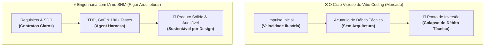
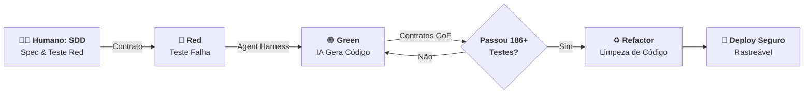

# 📜 MANIFESTO DE ENGENHARIA DE SOFTWARE

### Da Programação por Impulso à Engenharia de Software - AI Engineer &amp; Agent Harness

<!-- Badges de Auditoria Forense, Trilha DNA e Conformidade Legal -->

---

> "A tecnologia é efêmera, mas o rigor é eterno. Em um mundo onde a Inteligência Artificial pode expelir milhares de linhas de código em segundos, o valor do desenvolvedor não está mais na digitação, mas no julgamento. No projeto **Support Hours Manager (SHM)**, não aceitamos menos que o rigor técnico."* — **André Luis de Souza**

---

### 1. Prefácio: O Encontro da Experiência com a Inovação

Aos 54 anos, minha trajetória como **Engenheiro de Requisitos e Analista de Sistemas formado pelo UniCEUB** ensinou-me que a tecnologia é efêmera, mas o rigor é eterno. Ao longo das décadas, vi "balas de prata" surgirem e desaparecerem, mas o encontro com o **Prof. Sandeco Macedo** e o curso de **Engenharia de Software com IA** trouxe uma clareza definitiva: estamos diante de uma mudança de paradigma.

O projeto **SHM (Support Hours Manager)** não é meramente um exercício acadêmico; é a materialização de fundamentos clássicos orquestrados pela Inteligência Artificial.

A história do nosso *craft* é marcada por ciclos de amadorismo que custam caro. Para não sermos apenas passageiros da "vibe" do momento, precisamos converter a velocidade bruta dos LLMs em progresso sustentável, transformando o entusiasmo inicial em software de alta integridade.

---

### 2. A Ilusão do "Vibe Coding" e o Ponto de Inversão

O termo **"Vibe Coding"**, cunhado por Andrej Karpathy em 2025, descreve o perigoso estado de *flow* onde o desenvolvedor aceita sugestões de IAs por intuição, sem planejamento ou revisão crítica. Embora a sensação de onipotência seja inebriante, ela mascara a criação de um "software descartável" que carece de espinha dorsal arquitetural.

| Aspecto              | Programação por Impulso (*Vibe Coding*)                      | Engenharia de Software com IA (SHM)                                      |
| :-------------------- | :------------------------------------------------------------ | :------------------------------------------------------------------------ |
| **Tempo de Entrega** | Ilusão de velocidade que se arrasta por meses de retrabalho. | **Engenharia de verdade**, do zero ao produto testado e blindado.        |
| **Requisitos**       | Alucinados pela IA ou baseados em intuições voláteis.        | Levantados com rigor para resolver o problema real do negócio.           |
| **Processo**         | Acúmulo caótico de prompts sem rastro técnico ou testes.     | Abordagem sistemática, disciplinada e quantificável (**SDD + TDD**).     |
| **Sustentabilidade** | Custo de mudança cresce de forma exponencial até o colapso.  | Custo de evolução mantém-se linear, previsível e escalável.              |
| **Qualidade**        | Funciona por coincidência (*protótipo frágil*).              | Funciona por design, contratos formais e 186+ testes (*produto robusto*).|

>
> **O Ponto de Inversão Crítico:** A experiência do desenvolvimento de software nos ensina que o "juro" do débito técnico não perdoa. Projetos gerados por impulso sem processo atingem rapidamente o **Ponto de Inversão**: o momento em que a taxa de juros do débito acumulado torna-se impagável, onde qualquer nova funcionalidade custa mais caro e traz mais riscos do que se o projeto fosse reiniciado do zero.
>
> O **SHM quebrou esse paradigma:** foi projetado, arquitetado, testado e documentado em **apenas 7 dias de trabalho real de engenharia**, provando que a IA, quando contida por método e arquitetura, gera software de alta integridade em tempo recorde.

*Para evitar essa podridão arquitetural, é imperativo resgatar os fundamentos que dão ordem ao caos gerado pela IA.*

---

### 3. O Resgate dos Fundamentos: SWEBOK e GoF no SHM

A engenharia não reside na digitação, mas no governo do sistema. O **SWEBOK (*Software Engineering Body of Knowledge*)** é categórico: o código é apenas uma fração do ciclo de vida. A manutenção, por exemplo, consome até **80% do orçamento total** de um software. No SHM, o foco foi deslocado da escrita para a manutenibilidade e gestão de configuração.

Para domar a IA e impedir que ela gere um "macarrão de código", utilizamos os padrões **GoF (*Gang of Four*)** como **contratos de isolamento cognitivo**. Eles criam as fronteiras necessárias para que os agentes possam raciocinar sobre o código sem estourar janelas de contexto:

- 🧩 **Strategy:** Define contratos claros para algoritmos de cálculo de saldo e taxas, permitindo trocas sem impacto no núcleo.
- 🔔 **Observer:** Estabelece um mecanismo de notificação desacoplado para mudanças de estado de ciclos e contratos.
- 🏭 **Factory Method:** Centraliza a criação de objetos e instâncias de auditoria, impedindo que a lógica de negócio se suje com instanciações complexas.
- 🗄️ **Repository:** Isola o domínio do acesso a dados, protegendo o sistema contra flutuações de infraestrutura.

A governança do SHM repousa sobre três pilares:

1. **Sistemática:** O método precede a ação.
2. **Disciplinada:** O rigor é mantido mesmo sob pressão.
3. **Quantificável:** O progresso é medido por métricas reais, não por "vibes".

*Essas estruturas clássicas são agora os trilhos por onde correm os nossos novos colaboradores: os agentes inteligentes.*

---

### 4. A Nova Engenharia: SDD, TDD e o Agent Harness

O **AI Engineer** não escreve código; ele governa processos. No SHM, adotamos o **SDD (*Spec-Driven Development*)** como a nossa "especificação viva" — um contrato inegociável que dita as regras para a IA.

O ciclo de desenvolvimento é regido pelo rigor do **TDD (*Test-Driven Development*)** adaptado para agentes:

1. **Red:** O humano define o teste (o contrato de sucesso).
2. **Green:** O agente gera o código estritamente necessário para satisfazer o teste.
3. **Refactor:** Humano e IA limpam a estrutura, garantindo aderência aos padrões arquiteturais.

> [!TIP]
> **O Conceito de Agent Harness:** A peça-chave dessa engrenagem é o *Agent Harness*. Ele não é apenas um prompt, mas um conjunto de *skills*, *hooks* e regras que impõe restrições de domínio, evitando alucinações e transformando uma IA genérica em um arquiteto especializado no contexto do SHM.

---

### 5. O Contrato como DNA Imutável: A Auditoria Forense como Guardiã Patrimonial

No paradigma do *Vibe Coding*, logs de sistema costumam ser arquivos de texto descartáveis ou tabelas relacionais vulneráveis a edições manuais e `UPDATEs` arbitrários. No **SHM**, a relação contratual entre Tomador e Prestador é tratada como um ativo patrimonial inviolável.

A engenharia do SHM instituiu o conceito da **Trilha de Auditoria DNA do Contrato**:

1. **A Fita de DNA Transacional (Hash Chaining & RFC 8785):**
   Cada contrato ativo possui uma partição de custódia (`contrato:<id>`) estruturada exatamente como uma fita helicoidal de DNA. Partindo de um bloco gênese padronizado de 64 zeros, cada evento (aprovação de orçamento, aceite de entrega, compensação de débitos, migração de saldo ou agendamento de suporte) é serializado sob as regras determinísticas da **RFC 8785 (JSON Canonicalization Scheme - JCS)** e encadeado matematicamente com o hash do elo anterior (`previous_hash`) via **SHA-256**. É impossível alterar um único centésimo de hora ou justificativa no passado sem romper imediatamente toda a cadeia subsequente.
2. **Imutabilidade Real com Gatilhos Nativos de Banco:**
   Para além das travas do ORM, a integridade é garantida no nível físico do banco de dados pelo gatilho nativo PostgreSQL `trg_forensic_audit_immutability`. Qualquer instrução `UPDATE` ou `DELETE` disparada contra a trilha forense resulta em erro imediato e irrecuperável de banco de dados, blindando o sistema inclusive contra acessos de administradores ou agentes com privilégios de root.
3. **A Inversão da Caixa-Preta (Soberania Pericial e CPP Arts. 158-A a 158-F):**
   A verdadeira engenharia de software repudia o corporativismo da "caixa-preta". Em litígios periciais, a parte não deve ser obrigada a "confiar" na boa-fé da outra ou em relatórios estáticos em PDF. Em cumprimento à norma internacional **ISO/IEC 27037** e aos arts. 158-A a 158-F do Código de Processo Penal (Cadeia de Custódia de Vestígios Digitais), o SHM disponibiliza a **Página Oficial de Documentação Pericial** ([`/publico/auditoria-forense`](file:///C:/Users/andre/mkt-dnb/dev/Antigravity/projeto-SHM/frontend/src/pages/DocumentacaoAuditoriaPage.tsx)) e distribui um utilitário pericial em Python 3 puro e autocontido (`verificador_independente.py`). Peritos judiciais, policiais e assistentes técnicos podem baixar o validador e checar a integridade da cadeia de forma 100% offline em estações isoladas (*air-gapped*), sem depender do software operacional.
4. **Governança Síncrona e Alinhamento Técnico (Módulo Schedule):**
   A integridade da engenharia estende-se à comunicação interpessoal. O módulo **Schedule** integra compromissos e reuniões técnicas aos clientes e ciclos de atendimento, provisionando salas corporativas via Google Meet, acionando escalada tripla de lembretes automáticos (24h, 30m e 15m) e impondo justificativa mandatória com registro forense em cancelamentos.
5. **Armazenamento Híbrido Local-First & Custódia em Nuvem (Google Drive):**
   A custódia de evidências e artefatos de entrega (documentos contratuais, propostas, áudios periciais e anexos técnicos de chamados) não pode ser refém da instabilidade de serviços externos nem da fragilidade do disco isolado. O SHM consolida a arquitetura **Local-First na VPS com Espelhamento Assíncrono Contínuo no Google Drive corporativo**: cada arquivo é gravado localmente para resposta síncrona com latência zero e cálculo de integridade SHA-256 em streaming de blocos de 64KB. Em segundo plano pós-commit (`transaction.on_commit`), um despachador assíncrono espelha os arquivos via Google Service Account e provisiona a pasta raiz do tomador com compartilhamento exclusivo para o seu e-mail corporativo (`role: reader`), viabilizando auditoria independente, transparência bilateral e eliminação de links públicos vulneráveis.

---

### 6. A Perspectiva Histórica: Por Que o Processo é Inegociável?

Na aviação, a taxa de acidentes é de apenas **0,07 por milhão de voos** porque o processo é lei. Na medicina, checklists obrigatórios reduzem complicações em **47%**. No software, curiosamente, o mercado ainda chama a negligência de "ser ágil". Essa ironia profissional reflete-se nos dados estagnados do **Chaos Report 2020**: apenas **31%** dos projetos são bem-sucedidos, enquanto **50%** são "desafiados" (atrasos/custos extras) e **19%** falham ou são cancelados antes da entrega.

| Desastre Histórico | Ano     | Consequência                   | Causa Raiz / Falha de Processo                                                                          |
| :------------------ | :-------: | :------------------------------ | :------------------------------------------------------------------------------------------------------- |
| **Ariane 5**       | 1996    | Explosão do foguete (US$ 370M) | *Overflow* de inteiro; falha crítica na validação de requisitos no reuso de código sem novo contexto.   |
| **Therac-25**      | 1985–87 | Vítimas fatais por radiação    | Substituição de travas físicas por software não validado para condições de borda e concorrência real.   |
| **HealthCare.gov** | 2013    | Colapso total no lançamento    | Falha grave nos portões de processo (*gate failure*) e ausência de testes de integração sob carga real. |

*A história prova que o software não é "diferente"; ele apenas carece de responsabilidade formal. O processo não é burocracia; é ética profissional.*

---

### 7. Conclusão: O Manifesto para o Futuro Sustentável

O **SHM (Support Hours Manager)** prova que a velocidade da IA, quando contida por uma arquitetura sólida e pelo **Framework Reversa**, produz resultados excepcionais. Sob a mentoria do **Prof. Sandeco Macedo**, aprendi que o futuro não pertence a quem "digita prompts", mas a quem projeta sistemas que duram.

Construir software na era da IA exige o compromisso com estas premissas:

1. **A IA é o motor, o Engenheiro é o freio e o leme:** A responsabilidade final pela qualidade é humana e inalienável.
2. **Especificação é o novo código:** Sem o rigor do SDD, a velocidade da IA apenas acelera a chegada ao ponto de colapso.
3. **Manutenibilidade é a métrica da verdade:** Se o seu sistema não sobrevive à primeira mudança após o deploy, você não fez engenharia, fez artesanato digital.

Deixe para trás o amadorismo do *"Vibe Coding"*. Assuma seu papel como um verdadeiro **AI Engineer**.

---

### ✍️ Autoria e Compromisso Técnico

**André Luis de Souza**  
*Engenheiro de Requisitos , Analista de Sistemas e Desenvolvedor de Software*  
*Sob a luz dos ensinamentos de Sandeco Macedo*

