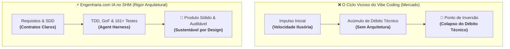
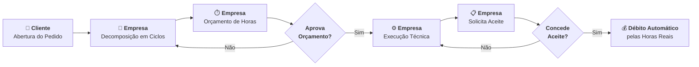
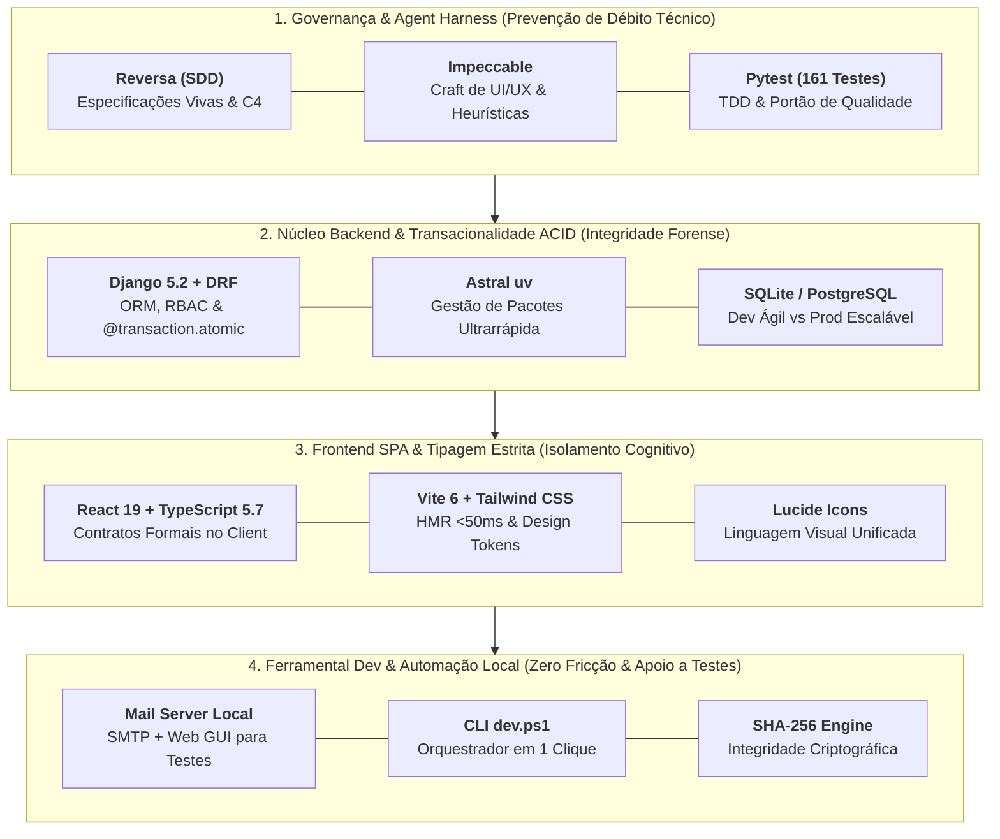

<div align="center">

# ⏱️ SHM — Support Hours Manager 2.5.3 "!Manifest Lock & Call"

**Engenharia de Software de Alta Integridade para Gestão de Contratos, Horas Técnicas, Ciclos de Atendimento e Governança Forense**

[](Manifesto/manifesto.md)
[](_reversa_sdd/)
[](https://physia.com.br/aieng/)
[](https://www.djangoproject.com/)
[](https://react.dev/)
[](https://www.typescriptlang.org/)
[](https://docs.pytest.org/)
[](https://developers.google.com/drive)
[](http://localhost:8000/api/docs/)
[](https://github.com/sandeco)

<!-- Badges de Auditoria Forense, Trilha DNA e Conformidade Legal -->
[](#️-5-auditoria-forense-trilha-dna-do-contrato--conformidade-legal)
[](#️-5-auditoria-forense-trilha-dna-do-contrato--conformidade-legal)
[](#️-5-auditoria-forense-trilha-dna-do-contrato--conformidade-legal)
[](#️-5-auditoria-forense-trilha-dna-do-contrato--conformidade-legal)
[](#️-5-auditoria-forense-trilha-dna-do-contrato--conformidade-legal)
[](#-documentação-oficial-de-auditoria-forense-e-perícia-independente)

[📜 Manifesto](#-manifesto-de-engenharia-da-programação-por-impulso-ao-software-de-verdade) • [🎓 Autoria](#-origem-mentoria--créditos-acadêmicos) • [🎯 O Que Resolve](#-o-que-o-shm-resolve-a-engenharia-a-serviço-do-negócio) • [🌟 Pilares do Produto](#-os-pilares-de-diferenciação-do-shm) • [🛡️ Trilha DNA](#️-5-auditoria-forense-trilha-dna-do-contrato--conformidade-legal) • [📅 Schedule & Meet](#-6-módulo-schedule-agendamento-google-meet--lembretes) • [☁️ Storage Híbrido](#-7-storage-híbrido-local-first--espelhamento-contínuo-no-google-drive) • [🔍 Perícia Independente](#-documentação-oficial-de-auditoria-forense-e-perícia-independente) • [🏛️ Arquitetura](#-arquitetura-do-sistema) • [⚖️ Racional Stack](#-racional-da-stack-tecnológica--análise-de-custo-benefício) • [🚀 Como Executar](#-como-executar) • [📚 Specs SDD](#-especificações-vivas-sdd--documentação-do-reversa)

---

</div>

> [!IMPORTANT]
> ### 📜 [DESTAQUE EXECUTIVO] Manifesto de Engenharia do SHM
> **Da Programação por Impulso à Engenharia de Software com IA**  
> *Por André Luis de Souza (sob a luz dos ensinamentos do Prof. Sandeco Macedo)*
> 
> *"A tecnologia é efêmera, mas o rigor é eterno. Em um mundo onde a Inteligência Artificial pode gerar milhares de linhas de código em segundos, o valor do desenvolvedor não está mais na velocidade com que digita, mas na lucidez com que julga, arquiteta e governa o sistema."*
> 
> 📄 **Manifesto Completo:** [`Manifesto/manifesto.md`](Manifesto/manifesto.md)  
> 📚 **Especificações Vivas (SDD):** [`_reversa_sdd/`](_reversa_sdd/)

---

## 📜 Manifesto de Engenharia: Da Programação por Impulso ao Software de Verdade

### ⚡ A Ilusão do *Vibe Coding* e o Ponto de Inversão
O termo **"Vibe Coding"** (Karpathy, 2025) descreve a codificação por impulso onde o desenvolvedor aceita sugestões de IAs sem questionamento crítico, gerando um "software descartável" sem espinha dorsal arquitetural.

Na ausência de processo e método, projetos baseados em geração desgovernada de código colapsam rapidamente sob o peso do débito técnico: o **Ponto de Inversão**, momento em que o juro do débito acumulado torna cada nova alteração mais cara e arriscada do que reconstruir o sistema do zero.

O **SHM quebrou esse paradigma:** foi projetado, arquitetado, testado e documentado em **apenas 7 dias de trabalho real de engenharia**, provando que a IA, quando contida por método e arquitetura, gera software de alta integridade em tempo recorde.



| Aspecto | Programação por Impulso (*Vibe Coding*) | Engenharia de Software com IA (SHM) |
| :--- | :--- | :--- |
| **Tempo de Entrega** | Ilusão de velocidade que se arrasta por meses de retrabalho. | **Engenharia de verdade**, do zero ao produto testado e blindado. |
| **Requisitos** | Alucinados pela IA ou baseados em intuições voláteis. | Levantados com precisão para resolver o problema real do negócio. |
| **Processo** | Acúmulo caótico de prompts sem rastro técnico ou testes. | Abordagem sistemática, disciplinada e quantificável (**SDD + TDD**). |
| **Sustentabilidade** | Custo de mudança cresce de forma exponencial até o colapso. | Custo de evolução mantém-se linear, previsível e escalável. |
| **Qualidade** | Funciona por coincidência (*protótipo frágil*). | Funciona por design, contratos formais e 161+ testes (*produto robusto*). |

---

### 🛡️ O Resgate dos Fundamentos: SWEBOK e GoF como Contratos de Isolamento
O **Support Hours Manager (SHM)** foi concebido para durar, sustentando-se nos pilares clássicos da ciência da computação:

* 📚 **Guia SWEBOK (*Software Engineering Body of Knowledge*):** Reconhece que a manutenção consome até **80% do orçamento total** de um software. No SHM, a prioridade absoluta é a manutenibilidade, rastreabilidade e governança de configuração.
* 🧩 **Padrões GoF (*Gang of Four*) como Isolamento Cognitivo:** Padrões como *Strategy*, *Observer*, *Factory Method* e *Repository* são empregados como fronteiras cognitivas que delimitam o raciocínio dos agentes de IA, impedindo o acoplamento e o estouro de janelas de contexto.
* 🤖 **O Paradigma do *AI Engineer* (*SDD + TDD + Agent Harness*):** A IA atua sob a tutela de um **Agent Harness** rigoroso. As especificações vivas (*Spec-Driven Development*) definem as leis inegociáveis, enquanto os testes automatizados (*Test-Driven Development*) blindam o comportamento do sistema.

### 🏛️ As Lições da História: Por Que o Processo é Inegociável?
Na aviação, a taxa de acidentes é de apenas **0,07 por milhão de voos** porque o processo é lei. Na medicina, checklists reduzem complicações em **47%**. Enquanto o **Chaos Report 2020** revela que **69% dos projetos de TI falham ou sofrem estouros graves**, desastres como *Ariane 5 (1996)*, *Therac-25 (1985)* e *HealthCare.gov (2013)* nos lembram que a negligência cobra vidas e bilhões. No SHM, adotamos três premissas inegociáveis:
1. **A IA é o motor, o Engenheiro é o freio e o leme:** A responsabilidade final pela qualidade é humana e inalienável.
2. **Especificação é o novo código:** Sem o rigor do SDD, a aceleração da IA apenas antecipa o abismo.
3. **Manutenibilidade é a métrica da verdade:** Software de verdade é desenhado para a sua próxima mudança.

---

## 🎓 Origem, Mentoria & Créditos Acadêmicos

Este projeto nasceu da confluência entre **décadas de experiência profissional em Engenharia de Requisitos** e a revolução dos **Agentes Autônomos de IA**.

O **SHM** foi concebido e implementado por **André Luis de Souza** (Engenheiro de Requisitos e Analista de Sistemas formado pelo UniCEUB), aplicando na íntegra os fundamentos do curso **Engenharia de Software com IA**, sob mentoria do **Prof. Sandeco Macedo**, e estruturado através do **Framework Reversa**.

### 👨‍🏫 Prof. Sandeco Macedo & Framework Reversa
* **Professor & Pesquisador:** Docente e pesquisador no **Instituto Federal de Goiás (IFG)** e na **Universidade Federal de Goiás (UFG)**, e Embaixador da Campus Party Brasil.
* **Autor & Referência:** Autor de mais de 10 obras consagradas sobre Inteligência Artificial, incluindo o livro definitivo [Engenharia de Software e Agentes Inteligentes](https://physia.com.br/aieng/).
* **Criador do Framework Reversa:** Metodologia pioneira de Engenharia Reversa e *Spec-Driven Development* (SDD) com Agentes Autônomos de IA ([GitHub: @sandeco](https://github.com/sandeco)).
* **Autor do Projeto:** [André Luis de Souza](https://github.com/andresouza72br-sketch), Engenheiro de Requisitos e Arquiteto de Software.

---

## 🎯 O Que o SHM Resolve: A Engenharia a Serviço do Negócio

Na prestação de serviços de TI e consultoria especializada, o maior vilão da lucratividade e do relacionamento com o cliente não é o código em si, mas a **falta de clareza na apuração de esforço**, a **dificuldade de aprovação de escopos** e a **desconfiança mútua no consumo de horas**.

O **SHM (Support Hours Manager)** substitui a informalidade de e-mails, planilhas e chamados genéricos por um ecossistema com **5 pilares de alta integridade e governança**:



---

## 🌟 Os 5 Pilares de Diferenciação do SHM

### 1. 🔄 Decomposição Cirúrgica em Ciclos Atômicos
* **Adeus aos Chamados Monolíticos:** Uma solicitação ampla do cliente é fracionada em ciclos atômicos bem definidos (*Corretiva, Evolutiva, Preventiva, Análise, Consultoria ou Treinamento*).
* **Orçamento Pré-Acordado vs. Realizado:** Cada ciclo possui seu próprio orçamento prévio em horas. A aprovação da estimativa pelo cliente autoriza o início dos trabalhos **sem debitar o saldo antecipadamente**.
* **Débito Exclusivo no Aceite:** O saldo de horas do contrato só é debitado quando a entrega é formalmente aceita pelo cliente, baseando-se estritamente nas **horas reais trabalhadas**.
* **Trava de Tolerância (+30%):** Se as horas reais ultrapassarem a tolerância máxima sobre o orçado, o sistema aciona uma governança especial com justificativa obrigatória e registro de exceção.

### 2. ⏱️ Gestão de Contratos, Saldos e Conciliação Atômica
* **Governança do Banco de Horas:** Controle estrito de franquia contratual, vigência temporal e carência pós-expiração.
* **Assistente Inteligente de Migração de Saldo:** Ao renovar ou abrir um novo contrato, o sistema detecta e sugere o aproveitamento imediato de saldos positivos de contratos encerrados.
* **Compensação e Quitação de Débitos:** Débitos técnicos ou horas excedentes de contratos anteriores são amortizados de forma justa no novo contrato, protegidos por uma **trava de teto** que impede descontos acima da dívida real.
* **Transacionalidade Atômica (`@transaction.atomic`):** Toda movimentação contábil entre contratos ocorre sob transações ACID no banco de dados, eliminando inconsistências.
* **Demonstrativo Visual de Conciliação:** O extrato oficial exibe uma régua matemática transparente:
  $$\text{Saldo Atual} = \text{Franquia Base} + \text{Resgate} - \text{Compensação} - \text{Consumo Real}$$

### 3. 💬 Comunicação Integrada & Feedback Contínuo (CSAT)
* **Discussão no Contexto da Entrega:** Fim dos acordos perdidos em aplicativos de mensagens. Toda a conversa técnica e de alinhamento acontece na *thread* do próprio ciclo.
* **Comentário Promovido a Tarefa:** Dúvidas ou novos pedidos surgidos em conversas podem ser promovidos a apontamentos ou tarefas com um único clique.
* **Avaliação de Satisfação Pós-Aceite:** Imediatamente após aprovar um ciclo, o cliente pode atribuir uma nota CSAT (1 a 5 estrelas) com feedback qualitativo, retroalimentando o indicador de qualidade do atendimento.

### 4. ⚡ Magic Links Públicos: Aprovação com Zero Atrito
* **Decisão em 1 Clique:** Tomadores de decisão e diretores muitas vezes não têm tempo para memorizar senhas ou navegar em sistemas complexos.
* **Segurança e Agilidade:** Através de links seguros com tokens UUID de uso restrito, o cliente visualiza o resumo executivo da entrega e concede o aceite formal direto do smartphone ou navegador, com total conforto e sem barreiras de login.

### 5. 🛡️ Auditoria Forense & Integridade Criptográfica (Trilha DNA do Contrato)
* **A Fita de DNA Transacional (*Hash Chaining* & RFC 8785):** Cada contrato possui uma partição indelével (`contrato:<id>`) que funciona exatamente como uma fita biológica de DNA. Cada evento contábil ou operacional (aprovação de orçamento, aceite de entrega, compensação de débitos, migração de saldo ou agendamento de suporte) é serializado sob as normas determinísticas da **RFC 8785 (JSON Canonicalization Scheme - JCS)** e encadeado ao elo anterior (`previous_hash`) com dispersão **SHA-256**, partindo de um bloco gênese de 64 zeros hexadecimais.
* **Gatilhos Nativos Anti-Mutação no Banco de Dados:** A imutabilidade é assegurada na camada física do banco pelo trigger PostgreSQL `trg_forensic_audit_immutability`. Qualquer comando SQL `UPDATE` ou `DELETE` disparado contra a trilha pericial é sumariamente rejeitado pelo motor do banco com erro irrecuperável.
* **Selo Noturno Diário (`AuditDailySeal`):** Às 23:59:59 de cada dia civil, uma rotina automatizada (`audit_seal_daily`) calcula o digest consolidado da cadeia de cada partição ativa, gerando um marco indelével no tempo e atestando que nenhum registro pretérito foi corrompido.
* **Timeline Pericial Interativa no Extrato:** O Extrato Oficial do Contrato conta com o componente [`TimelineAuditoriaContrato`](frontend/src/components/contratos/TimelineAuditoriaContrato.tsx), permitindo auditar evento a evento, inspecionar hashes SHA-256, verificar metadados periciais (IP de origem, User-Agent, carimbo temporal ISO-8601) e justificativas técnicas obrigatórias (**RN-12**).
* **Integridade de Documentos com SHA-256:** Contratos assinados, aditivos e laudos periciais recebem assinatura criptográfica SHA-256 no momento do upload, auditados a qualquer tempo pelo endpoint `/api/v1/contratos/{id}/auditar_documentos/`.

### 6. 📅 Módulo Schedule: Agendamento Técnico, Integração Google Meet e Lembretes Programados
* **Centralização de Reuniões Técnicas (`apps.schedule`):** Elimina reuniões informais e promessas de suporte sem ata. Cada agendamento é vinculado obrigatoriamente a um Cliente tomador e opcionalmente ao contexto operacional de um Pedido (OS), Ciclo ou Tarefa.
* **Integração Nativa Google Calendar & Google Meet (`GoogleCalendarService`):** Provisão automática de salas corporativas Google Meet (`google_meet_link`) persistidas diretamente no banco, permitindo acesso em 1 clique tanto para a equipe técnica quanto para o tomador.
* **Escalada Tripla de Lembretes Programados (`LembreteAgendamento`):** Criação atômica de 3 marcos temporais (`24h`, `30m` e `15m` antes do evento). Rotina de disparo idempotente (`processar_lembretes_schedule`) que envia e-mails transacionais em HTML responsivo com CTA direto para a sala Meet e alertas *in-app*.
* **Governança Declarativa & Supressão para o Autor:** O organizador do agendamento não é poluído com auto-alertas in-app, respeitando a matriz de notificações declarativas do sistema.
* **Cancelamento Auditado com Justificativa Mandatória:** O cancelamento de qualquer agendamento exige justificativa técnica obrigatória registrada na trilha de auditoria forense criptográfica (`ForensicAuditService`).
* **Gravador de Áudio com Codificação MP3 Nativa:** Microfone embutido com transcoder MP3 cliente (`@breezystack/lamejs`) para anexação de briefings por voz em chamados e mensagens técnicas sem perda de qualidade.

### 7. ☁️ Storage Híbrido Local-First & Espelhamento Contínuo no Google Drive
* **Latência Zero na VPS (Local-First):** Todo upload de anexo em pedidos de suporte, ciclos de entrega e mensagens de áudio é gravado de imediato no disco local da VPS em caminhos estruturados deterministicamente por cliente (`/media/clientes/{cliente_id}/...`). Requisições do usuário respondem instantaneamente sem depender de APIs externas para upload ou streaming.
* **Integridade Criptográfica em Streaming (SHA-256):** O hash criptográfico é computado em streaming (chunks de 64KB) durante a persistência, sem consumir a memória RAM do servidor, e registrado de forma imutável nos modelos do banco.
* **Espelhamento Assíncrono Desacoplado (`on_commit`):** Um despachador assíncrono espelha em background os arquivos locais para o Google Drive corporativo autenticado via Google Service Account corporativa (`GoogleDriveStorageService`).
* **Provisionamento Hierárquico & Isolamento Estrito:** Pastas raiz por cliente (`[SHM] {Nome} (ID: {id})`) são criadas e compartilhadas exclusivamente com a conta Google corporativa do cliente (`email_google_drive`), garantindo acesso seguro com permissão `role: reader` e impedindo links públicos.
* **Expurgo em Cascata & Contingência CLI:** Signals `post_delete` garantem a exclusão física do espelho no Google Drive quando o anexo é removido na VPS. O comando administrativo `python manage.py sincronizar_storage_drive` permite contingência de rede, backfill e reprocessamento automático de arquivos pendentes.

---

## 🔍 Documentação Oficial de Auditoria Forense & Perícia Independente

O **SHM** disponibiliza uma infraestrutura de documentação pericial viva, acessível tanto no painel autenticado quanto publicamente para autoridades, assistentes técnicos e peritos judiciais:

* 🌐 **Rota Pública Pericial (Acesso Livre para Peritos e Juízes):** [`/publico/auditoria-forense`](frontend/src/pages/DocumentacaoAuditoriaPage.tsx)
* 🔐 **Rota Protegida no Dashboard Corporativo:** [`/documentacao/auditoria-forense`](frontend/src/pages/DocumentacaoAuditoriaPage.tsx)
* 📑 **Componente de Navegação com Índice Flutuante Centralizado:** [`DocumentacaoSidebarTOC`](frontend/src/components/documentacao/DocumentacaoSidebarTOC.tsx)

### 📚 As 7 Seções da Documentação Pericial
1. **Fundamentos e Defesa do SHM:** O princípio da proteção mútua bilateral — auditoria como garantia patrimonial, matemática e código como árbitro imparcial do contrato.
2. **Workflow da Trilha Forense em 7 Passos:** Lock pessimista por partição, recuperação do elo anterior, normalização canônica RFC 8785, dispersão SHA-256, gravação atômica, bloqueio nativo PostgreSQL e lavratura do selo noturno.
3. **Tecnologias de Garantia da Imutabilidade:** RFC 8785 (Canonicidade JCS), FIPS 180-4 (SHA-256), trigger PostgreSQL `trg_forensic_audit_immutability` e justificativa técnica mandatória N1 (RN-12).
4. **Exemplos Práticos & Detecção de Fraude:** Demonstração interativa de payload bruto vs canônico e simulação de tentativa de corrupção de dados com quebra de cadeia detectada pelo algoritmo.
5. **Protocolo Pericial e Varredura Policial:** Roteiro prático para forças de investigação civil/federal e peritos criminais via API (`GET /api/v1/contratos/{id}/trilha_forense/`) e comando Django (`audit_verify_integrity`).
6. **Script Autocontido para Perícia Offline (*Air-Gapped*):** Utilitário em Python 3 puro (`verificador_independente.py`) sem bibliotecas externas (`pip`), disponibilizado para download e execução em computadores isolados de rede, em cumprimento à norma **ISO/IEC 27037**.
7. **Enquadramento Jurídico, Certificações e Normas:**
   - **CPP Arts. 158-A a 158-F (Lei 13.964/2019 - Pacote Anticrime):** Validade estrita da Cadeia de Custódia de Prova Digital.
   - **CPC Arts. 411 e 422:** Força probatória irrefutável e eficácia documental de registros eletrônicos.
   - **ISO/IEC 27037:2012:** Diretrizes de identificação, coleta e custódia pericial de vestígios computacionais.
   - **RFC 8785 / RFC 4998:** Canonicidade JSON e Evidence Record Syntax (ERS).

### 🛠️ Comandos de Verificação Pericial (CLI & Shell)

```bash
# 1. Varredura e verificação matemática da partição de um contrato:
python backend/manage.py audit_verify_integrity --partition=contrato:12 --verbose

# 2. Consolidação manual do Selo Diário Noturno:
python backend/manage.py audit_seal_daily

# 3. Execução offline do Verificador Independente sobre arquivo JSON extraído:
python frontend/src/utils/verificador_independente.py --arquivo trilha_contrato_12.json --verbose

# 4. Verificação em pipeline direto via API REST:
curl -s -H "Authorization: Bearer <TOKEN>" "http://localhost:8000/api/v1/contratos/12/trilha_forense/" | python frontend/src/utils/verificador_independente.py --stdin
```

---

## 🏛️ Arquitetura do Sistema

```
projeto-SHM/
├── Manifesto/                # Manifesto de Fundamentos de Engenharia de Software
│   └── manifesto.md          # Ensaio completo: Vibe Coding vs Engenharia de Alta Integridade
│
├── _reversa_sdd/             # Especificações SDD (Spec-Driven Development) do Reversa
│   ├── adrs/                 # Architectural Decision Records (ADR 001 a 015)
│   ├── addenda/              # Adendos de convergência das features evolutivas (001 a 011)
│   └── ...                   # C4 Models, contratos e dicionários de dados
│
├── backend/                  # Django 5.2 REST Framework
│   ├── apps/
│   │   ├── accounts/         # Usuários customizados e RBAC (Empresa vs Cliente)
│   │   ├── clientes/         # Cadastro PF/PJ com validação de CPF/CNPJ
│   │   ├── contratos/        # Gestão contratual, upload com SHA-256, extratos e trilha forense
│   │   ├── pedidos/          # Protocolos OS, agrupador de chamados
│   │   ├── ciclos/           # Workflow de ciclos, estados e Magic Links
│   │   ├── tarefas/          # Apontamento técnico de esforço e horas reais
│   │   ├── saldo/            # Ledger imutável, transferências e compensação de débitos
│   │   ├── comunicacao/      # Thread de comentários e conversão em tarefas
│   │   ├── notificacoes/     # Central declarativa de notificações e supressão de auto-alerta
│   │   ├── schedule/         # Agendamentos, integração Google Meet e lembretes programados
│   │   └── core/             # Middlewares, storage híbrido Google Drive e auditoria pericial
│   ├── config/               # Settings, JWT, URLs e OpenAPI Swagger
│   └── tests/                # Suíte de 186 testes automatizados (unitários, integração e periciais)
│
├── frontend/                 # React 19 + TypeScript 5.7 + Vite 6.1 + Tailwind CSS
│   └── src/
│       ├── api/              # Cliente Axios com interceptors JWT e auto-refresh
│       ├── components/
│       │   ├── layout/       # Header, Sidebar de Contratos, AppLayout
│       │   ├── kanban/       # Kanban Board responsivo de 6 colunas
│       │   ├── contratos/    # Modais, Timeline de Auditoria Forense e Documentos
│       │   ├── documentacao/ # TOC lateral flutuante centralizado e visualizadores de laudos
│       │   ├── schedule/     # Agenda de suporte, modal de reuniões e widget próxima reunião
│       │   └── ciclos/       # Carrossel navegável de ciclos, comentários e CSAT
│       ├── contexts/         # AuthContext com controle de permissões
│       ├── pages/            # Extrato Oficial, DocumentacaoAuditoriaPage, LogHashChainingPage, SchedulePage
│       ├── utils/            # Utilitário pericial Python puro (verificador_independente.py)
│       └── types/            # Tipos e interfaces estritas TypeScript
│
├── tools/                    # Utilitários de desenvolvimento, banco, testes e automação
│   ├── mail-server/          # Servidor SMTP local para captura de e-mails em dev
│   ├── database/             # Scripts de reset e seed determinístico (base limpa)
│   └── scripts/              # Utilitários de automação e git-hooks de governança
│
└── docs/                     # Documentação de API, Workflow e Guias
```

---

## ⚖️ Racional da Stack Tecnológica & Análise de Custo-Benefício

> *"A tecnologia é efêmera, mas o rigor é eterno. Em engenharia de verdade, nenhuma biblioteca é escolhida por modismo ou 'hype': cada peça da arquitetura é um compromisso consciente entre custo de adoção, velocidade de entrega e o custo de manutenção a longo prazo."* — [**Manifesto de Engenharia SHM**](Manifesto/manifesto.md)

O **SWEBOK (*Software Engineering Body of Knowledge*)** estabelece que a manutenção consome até **80% do custo total do ciclo de vida** de um software. No paradigma da Engenharia de Software com IA, a stack tecnológica não serve apenas para executar código: ela atua como um **Agent Harness (gaiola de contenção)** que impõe fronteiras cognitivas rígidas, impedindo alucinações dos LLMs e blindando o sistema contra o colapso do débito técnico.

Abaixo, detalhamos o racional técnico, os trade-offs e o retorno sobre o investimento (ROI) de cada camada da stack:



### 📊 Matriz de Trade-offs e Retorno sobre o Investimento (ROI)

| Camada | Tecnologia | Custo / Trade-off | Benefício Real de Engenharia (ROI & Governança) | Conexão com o Manifesto |
| :--- | :--- | :--- | :--- | :--- |
| **Metodologia IA** | **Reversa (SDD)** | Exige disciplina de especificação e modelagem antes de digitar código. | **Elimina o "Vibe Coding" e o retrabalho em ~80%.** Cria limites claros de contexto para agentes de IA atuarem com zero alucinação de regras de negócio. | *"Especificação é o novo código."* |
| **Craft UI/UX** | **Impeccable** | Curva de refinamento visual e aplicação rigorosa de heurísticas. | **Elimina a dívida técnica estética (*AI slop*).** Entrega interfaces com acabamento de nível diretor de arte, acessibilidade nativa (a11y) e design tokens consistentes. | *"Manutenibilidade é a métrica da verdade."* |
| **Backend & ORM** | **Python 3.11 + Django 5.2 + DRF** | Estrutura opinativa mais densa que microframeworks como Flask/FastAPI. | **Integridade ACID e Governança Forense nativa.** O `@transaction.atomic` blinda o Livro-Razão (`HistoricoSaldo`), enquanto o ORM, as migrações automáticas e o RBAC evitam que a IA reinvente regras de segurança. | *"GoF e DDD como Contratos de Isolamento Cognitivo."* |
| **Auditoria Forense (DNA)** | **RFC 8785 + SHA-256 + PostgreSQL Triggers** | Lock pessimista por partição e complexidade de canonicalização determinística. | **Eficácia probatória judicial irrefutável (CPP 158-A a F, CPC 411/422).** Torna fraudes e adulterações retroativas matematicamente impossíveis mesmo com acesso root ao banco. | *"O código e a matemática como árbitro imparcial."* |
| **Agendamento & Meet** | **apps.schedule + Google Calendar API** | Gestão de credenciais de serviço e fallback para agendamento local em caso de indisponibilidade externa. | **Alinhamento síncrono pontual sem atrito.** Automatiza salas Meet, escala tripla de lembretes e auditoria pericial obrigatória para cancelamentos. | *"Comunicação com clareza e sem reuniões informais."* |
| **Package Manager** | **Astral `uv`** | Introduz uma ferramenta externa escrita em Rust no ecossistema Python. | **Resolução e instalação 10x a 100x mais rápida que o `pip`.** Reduz drasticamente o tempo de build, testes em CI e inicialização do ambiente local. | *"Velocidade com determinismo e sem atrito."* |
| **Testes Automatizados** | **Pytest + Faker (161 Testes)** | Tempo de escrita e manutenção contínua de fixtures e cenários de borda. | **Portão de qualidade inegociável (*Gatekeeper*).** Garante que refatorações de agentes de IA nunca introduzam regressões no cálculo contábil de horas (+30%), compensação de saldo, hashes SHA-256 ou encadeamento RFC 8785. | *"TDD: o contrato de sucesso entre Humano e Agente."* |
| **Frontend & Type Safety** | **React 19 + TypeScript 5.7** | Tipagem estrita exige código mais verboso na definição de interfaces. | **Contratos formais no Client-Side.** O compilador (`tsc`) atua como oráculo de validação instantânea para a IA: qualquer desalinhamento de API é detectado no build, antes do runtime. | *"Redução do erro humano e de IA antes do deploy."* |
| **Build & Estilização** | **Vite 6 + Tailwind CSS** | Estilização por classes utilitárias no JSX em vez de arquivos CSS clássicos. | **HMR instantâneo (<50ms) e bundle enxuto (~800KB).** Elimina conflitos de escopo global de CSS e garante consistência visual imediata em modo Claro e Escuro. | *"Eficiência de runtime e agilidade de feedback."* |
| **Apoio a Testes de E-mail** | **SMTP Server Local (`tools/mail-server`)** | Microserviço utilitário dedicado exclusivamente ao apoio de testes manuais e desenvolvimento. | **Custo zero com provedores de terceiros (SendGrid/Mailgun)** e risco zero de disparo indevido em dev. Permite testar o fluxo completo de Magic Links e lembretes 100% offline e com privacidade total. | *"Privacidade, soberania de dados e testes realistas."* |
| **Orquestração Dev** | **CLI `dev.ps1`** | Manutenção de scripts PowerShell para automação local. | **Onboarding instantâneo de 1 comando.** Inicializa toda a stack (Backend, Frontend, SMTP Server) e reseta o banco determinístico em menos de 10 segundos. | *"O processo precede a ação: eliminação da fricção operacional."* |

---

## 🚀 Como Executar

### ⚡ Modo Rápido: Orquestrador CLI (`dev.ps1`)

Para maior comodidade, utilize o script de orquestração unificada no PowerShell:

```powershell
# 1. Iniciar toda a stack (Backend + Frontend + Mail Server SMTP)
.\dev.ps1 start

# 2. Verificar status dos serviços e portas ativas
.\dev.ps1 status

# 3. Resetar banco SQLite com base limpa determinística (tools/database)
.\dev.ps1 reset-db

# 4. Executar a suíte de 79 testes automatizados
.\dev.ps1 test

# 5. Parar todos os serviços
.\dev.ps1 stop
```

---

### 🛠️ Modo Manual: Passo a Passo

#### 1. Pré-requisitos
* **Python 3.11+**
* **Node.js 20+** ou **Bun 1.2+**
* **Git**

#### 2. Backend (API REST)
```bash
# 1. Crie e ative o ambiente virtual
uv venv .venv
# No Windows PowerShell:
.\.venv\Scripts\activate

# 2. Instale as dependências
uv pip install -r backend/requirements.txt --python .venv\Scripts\python.exe

# 3. Execute as migrações do banco de dados
.\.venv\Scripts\python.exe backend/manage.py migrate

# 4. Popule com dados de demonstração (inclui contratos com saldo remanescente e devedor)
.\.venv\Scripts\python.exe backend/manage.py seed_demo_data

# 5. Inicie o servidor Django
.\.venv\Scripts\python.exe backend/manage.py runserver 8000
```
* 📖 **Swagger OpenAPI UI**: [http://localhost:8000/api/docs/](http://localhost:8000/api/docs/)
* ⚙️ **Painel Administrativo Django**: [http://localhost:8000/admin/](http://localhost:8000/admin/)

---

#### 3. Frontend (Web App)
```bash
# 1. Acesse a pasta do frontend
cd frontend

# 2. Instale as dependências
npm install   # ou bun install

# 3. Inicie o servidor de desenvolvimento
npm run dev   # ou bun run dev
```
* 🌐 **Aplicação Web**: [http://localhost:5173](http://localhost:5173)

---

## 🔑 Credenciais de Demonstração

| Perfil | Usuário | E-mail Corporativo Modelo | Senha | Papel no Sistema |
| :--- | :--- | :--- | :--- | :--- |
| **Cliente Gerente** | `cligerente` | `gerente@acme.com` | `cliente123` | Tomador da Acme Corp. Aprova orçamentos e concede aceites finais. |
| **Cliente Analista** | `clianalista` | `analista@acme.com` | `cliente123` | Usuário solicitante da Acme Corp. Abre pedidos e acompanha kanban. |
| **Empresa Admin** | `admin` | `admin@shm.local` | `admin123` | Administrador prestador. Gestão geral de contratos, saldos e clientes. |
| **Empresa Técnico** | `tecnico` | `tecnico@shm.local` | `tecnico123` | Operador técnico. Triagem, estimativa de ciclos e apontamento de tarefas. |

---

## 🧪 Testes Automatizados

### Backend (Pytest — 186 Testes)
```bash
uv run --with-requirements backend/requirements.txt pytest
```

### Frontend (Build & Type-Check)
```bash
cd frontend && npm run build
```

---

## 📚 Especificações Vivas SDD & Documentação do Reversa

A documentação do **SHM** é mantida como um conjunto de **especificações vivas** em [`_reversa_sdd/`](_reversa_sdd/), versionada diretamente no repositório. Toda alteração arquitetural, nova regra de negócio ou adendo gerado pelo framework **Reversa** reflete-se automaticamente no GitHub:

### 🏛️ 1. Visão Global & Engenharia
* 📜 **Manifesto:** [`Manifesto/manifesto.md`](Manifesto/manifesto.md) — *Da Programação por Impulso à Engenharia de Software - AI Engineer & Agent Harness*
* 🏛️ **Arquitetura Geral:** [`_reversa_sdd/architecture.md`](_reversa_sdd/architecture.md) & [`ARCHITECTURE.md`](ARCHITECTURE.md)
* 🧩 **Modelo de Domínio:** [`_reversa_sdd/domain.md`](_reversa_sdd/domain.md)
* 📖 **Dicionário de Dados:** [`_reversa_sdd/data-dictionary.md`](_reversa_sdd/data-dictionary.md)
* 🗄️ **Diagrama ERD Completo:** [`_reversa_sdd/erd-complete.md`](_reversa_sdd/erd-complete.md)
* 🔍 **Análise de Código & Hotspots:** [`_reversa_sdd/code-analysis.md`](_reversa_sdd/code-analysis.md)
* 🎯 **Relatório de Confiança:** [`_reversa_sdd/confidence-report.md`](_reversa_sdd/confidence-report.md)

### 📐 2. Diagramas C4 Model
* 🌐 **C4 Nível 1 (Contexto):** [`_reversa_sdd/c4-context.md`](_reversa_sdd/c4-context.md)
* 📦 **C4 Nível 2 (Contêineres):** [`_reversa_sdd/c4-containers.md`](_reversa_sdd/c4-containers.md)
* ⚙️ **C4 Nível 3 (Componentes):** [`_reversa_sdd/c4-components.md`](_reversa_sdd/c4-components.md)

### 📜 3. Decisões Arquiteturais Registradas (ADRs)
* [**ADR 001**](_reversa_sdd/adrs/001-decomposicao-em-ciclos-e-debito-no-aceite.md) — Decomposição em Ciclos Atômicos e Débito Exclusivo no Aceite Formal
* [**ADR 002**](_reversa_sdd/adrs/002-ledger-imutavel-historico-saldo.md) — Livro-Razão Imutável (*Ledger*) de Movimentações de Saldo
* [**ADR 003**](_reversa_sdd/adrs/003-magic-links-publicos-sem-atrito.md) — Magic Links Públicos para Aprovação sem Fricção
* [**ADR 004**](_reversa_sdd/adrs/004-integridade-criptografica-sha256-em-documentos.md) — Integridade Criptográfica SHA-256 em Anexos Contratuais
* [**ADR 005**](_reversa_sdd/adrs/005-aprovacao-cadastral-de-clientes-por-magic-link.md) — Aprovação Cadastral de Novos Clientes via Magic Link
* [**ADR 006**](_reversa_sdd/adrs/006-avaliacao-de-satisfacao-pos-aceite.md) — Pesquisa de Satisfação (CSAT) Integrada Pós-Aceite
* [**ADR 007**](_reversa_sdd/adrs/007-compensacao-de-debitos-e-resgate-atomico-de-saldo.md) — Compensação de Débitos e Resgate Atômico de Saldo entre Contratos
* [**ADR 008**](_reversa_sdd/adrs/008-trava-tolerancia-ciclos.md) — Trava de Tolerância de 30% em Ciclos e Aceite de Exceção
* [**ADR 009**](_reversa_sdd/adrs/009-central-declarativa-notificacoes.md) — Central Declarativa de Notificações com Matriz de Preferências
* [**ADR 010**](_reversa_sdd/adrs/010-supressao-notificacoes-autor.md) — Supressão de Auto-Notificações para o Autor da Ação
* [**ADR 011**](_reversa_sdd/adrs/011-trilha-auditoria-forense-hash-chaining-rfc8785.md) — Trilha de Auditoria Forense com Hash Chaining (RFC 8785 / SHA-256) e Gatilhos Nativos de Imutabilidade
* [**ADR 012**](_reversa_sdd/adrs/012-documentacao-pericial-autocontida-indice-flutuante.md) — Página Oficial de Documentação Pericial com Índice Flutuante e Verificador Autocontido
* [**ADR 013**](_reversa_sdd/adrs/013-agendamento-reunioes-google-meet-e-auditoria.md) — Agendamento de Reuniões Técnicas, Integração Google Meet e Disparo Programado de Lembretes
* [**ADR 014**](_reversa_sdd/adrs/014-desacoplamento-painel-hash-chaining-e-governanca-notificacoes.md) — Desacoplamento da Estação Pericial Hash Chaining e Governança de Notificações
* [**ADR 015**](_reversa_sdd/adrs/015-storage-hibrido-vps-google-drive.md) — Armazenamento Híbrido Local-First na VPS com Espelhamento Contínuo no Google Drive e Compartilhamento de Pastas

### 📊 4. Matriz de Módulos SDD (*Spec-Driven Development*)

| Módulo de Domínio | Requisitos (*Requirements*) | Design Técnico | Contratos de API | Tarefas de Implementação | Fluxograma Visual |
| :--- | :---: | :---: | :---: | :---: | :---: |
| **Contratos & Vigência** | [📄 Req](_reversa_sdd/contratos/requirements.md) | [🛠️ Design](_reversa_sdd/contratos/design.md) | [🔌 API](_reversa_sdd/contratos/contracts.md) | [✅ Tasks](_reversa_sdd/contratos/tasks.md) | [📊 Flow](_reversa_sdd/flowcharts/contratos.md) |
| **Ciclos & Aceite** | [📄 Req](_reversa_sdd/ciclos/requirements.md) | [🛠️ Design](_reversa_sdd/ciclos/design.md) | [🔌 API](_reversa_sdd/ciclos/contracts.md) | [✅ Tasks](_reversa_sdd/ciclos/tasks.md) | [📊 Flow](_reversa_sdd/flowcharts/ciclos.md) |
| **Saldo & Ledger** | [📄 Req](_reversa_sdd/saldo/requirements.md) | [🛠️ Design](_reversa_sdd/saldo/design.md) | [🔌 API](_reversa_sdd/saldo/contracts.md) | [✅ Tasks](_reversa_sdd/saldo/tasks.md) | [📊 Flow](_reversa_sdd/flowcharts/saldo.md) |
| **Pedidos de Suporte (OS)** | [📄 Req](_reversa_sdd/pedidos/requirements.md) | [🛠️ Design](_reversa_sdd/pedidos/design.md) | [🔌 API](_reversa_sdd/pedidos/contracts.md) | [✅ Tasks](_reversa_sdd/pedidos/tasks.md) | [📊 Flow](_reversa_sdd/flowcharts/pedidos.md) |
| **Core & Storage Híbrido** | [📄 Req](_reversa_sdd/core/requirements.md) | [🛠️ Design](_reversa_sdd/core/design.md) | [🔌 API](_reversa_sdd/core/contracts.md) | [✅ Tasks](_reversa_sdd/core/tasks.md) | [📊 Flow](_reversa_sdd/flowcharts/core-storage_hibrido_drive.md) |
| **Tarefas & Horas Reais** | [📄 Req](_reversa_sdd/tarefas/requirements.md) | [🛠️ Design](_reversa_sdd/tarefas/design.md) | [🔌 API](_reversa_sdd/tarefas/contracts.md) | [✅ Tasks](_reversa_sdd/tarefas/tasks.md) | [📊 Flow](_reversa_sdd/flowcharts/tarefas.md) |
| **Clientes & Acessos** | [📄 Req](_reversa_sdd/clientes/requirements.md) | [🛠️ Design](_reversa_sdd/clientes/design.md) | [🔌 API](_reversa_sdd/clientes/contracts.md) | [✅ Tasks](_reversa_sdd/clientes/tasks.md) | [📊 Flow](_reversa_sdd/flowcharts/clientes.md) |
| **Comunicação & Feedback** | [📄 Req](_reversa_sdd/comunicacao/requirements.md) | [🛠️ Design](_reversa_sdd/comunicacao/design.md) | [🔌 API](_reversa_sdd/comunicacao/contracts.md) | [✅ Tasks](_reversa_sdd/comunicacao/tasks.md) | [📊 Flow](_reversa_sdd/flowcharts/comunicacao.md) |
| **Notificações & E-mails** | [📄 Req](_reversa_sdd/notificacoes/requirements.md) | [🛠️ Design](_reversa_sdd/notificacoes/design.md) | [🔌 API](_reversa_sdd/notificacoes/contracts.md) | [✅ Tasks](_reversa_sdd/notificacoes/tasks.md) | [📊 Flow](_reversa_sdd/flowcharts/notificacoes.md) |
| **Schedule & Agenda** | [📄 Req](_reversa_sdd/schedule/requirements.md) | [🛠️ Design](_reversa_sdd/schedule/design.md) | [🔌 API](_reversa_sdd/schedule/tasks.md) | [✅ Tasks](_reversa_sdd/schedule/tasks.md) | [📊 Flow](_reversa_sdd/adrs/013-agendamento-reunioes-google-meet-e-auditoria.md) |
| **Auditoria Forense (DNA)** | [📄 Req](_reversa_sdd/addenda/005-auditoria-hash-chaining.md) | [🛠️ Design](_reversa_sdd/adrs/011-trilha-auditoria-forense-hash-chaining-rfc8785.md) | [🔌 API](_reversa_forward/005-auditoria-hash-chaining/interfaces/audit-trail-api.md) | [✅ Tasks](_reversa_sdd/adrs/012-documentacao-pericial-autocontida-indice-flutuante.md) | [📊 Flow](_reversa_sdd/flowcharts/frontend-documentacao_auditoria_toc_scroll.md) |
| **Accounts / RBAC** | [📄 Req](_reversa_sdd/accounts/requirements.md) | [🛠️ Design](_reversa_sdd/accounts/design.md) | [🔌 API](_reversa_sdd/accounts/contracts.md) | [✅ Tasks](_reversa_sdd/accounts/tasks.md) | [📊 Flow](_reversa_sdd/flowcharts/accounts.md) |
| **Frontend React App** | [📄 Req](_reversa_sdd/frontend/requirements.md) | [🛠️ Design](_reversa_sdd/frontend/design.md) | [🔌 API](_reversa_sdd/frontend/contracts.md) | [✅ Tasks](_reversa_sdd/frontend/tasks.md) | [📊 Flow](_reversa_sdd/flowcharts/frontend.md) |

### 🚀 5. Adendos de Features Evolutivas (*Addenda*)
* 🎯 [**Addendum 001:** Trava de Tolerância de 30% em Ciclos e Aceite de Exceção](_reversa_sdd/addenda/001-trava-tolerancia-ciclos.md)
* ⚡ [**Addendum 002:** Assistente de Migração de Saldo, Compensação de Débitos e Conciliação](_reversa_sdd/addenda/002-migracao-saldo-contratos.md)
* 🔕 [**Addendum 003:** Supressão de Notificações para o Autor da Ação](_reversa_sdd/addenda/003-nao-enviar-para-autor.md)
* 🎙️ [**Addendum 004:** Anexos em Pedidos, Ciclos e Gravador de Áudio MP3](_reversa_sdd/addenda/004-anexos-pedidos-ciclos-msgs.md)
* 🛡️ [**Addendum 005:** Trilha de Auditoria Forense com Hash Chaining (RFC 8785 / SHA-256) e Gatilhos Nativos](_reversa_sdd/addenda/005-auditoria-hash-chaining.md)
* 📑 [**Addendum 006:** Documentação Pericial Autocontida com Índice Flutuante e Verificador Independente](_reversa_sdd/addenda/006-doc-auditoria-forense.md)
* 📅 [**Addendum 007:** Módulo Schedule, Integração Google Meet e Disparo Programado de Lembretes](_reversa_sdd/addenda/007-modulo-schedule-google-meet.md)

---

## 📄 Licença

Este projeto é desenvolvido sob a licença MIT. Consulte o arquivo `LICENSE` para mais detalhes.
