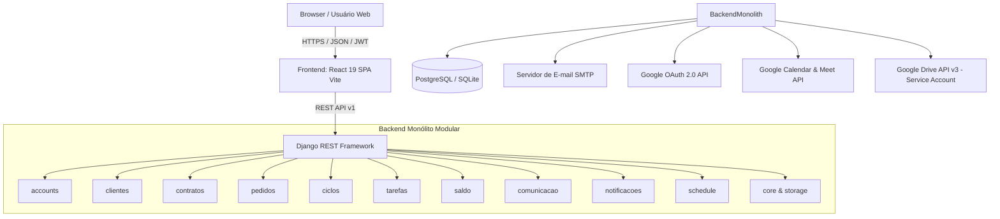

# Arquitetura Geral do Sistema — SHM 2.5.0

> Gerado pelo **Reversa Architect** em 2026-09-05  
> Sistema: **SHM 2.5.0 (Support Hours Manager)**

---

## 1. Visão Arquitetural

O **SHM 2.5.0** adota o modelo de **Monólito Modular no Backend** (Django Apps com separação estrita de responsabilidades por domínios) e **Single Page Application (SPA) desacoplada no Frontend** (React 19 + TypeScript).

---

## 2. Padrões de Projeto e Diretrizes

1. **Service Layer Pattern:** A lógica de negócio e as orquestrações transacionais residem nas classes `*Service` (ex: `SaldoService`, `CicloService`, `ContratoService`, `PedidoService`, `GoogleDriveStorageService`, `GoogleCalendarService`), mantendo as Views do DRF enxutas e focadas em validação HTTP e serialização.
2. **Isolamento ACID & Locks Pessimistas:** Operações contábeis que alteram saldo ou transferem horas entre contratos utilizam `select_for_update()` com ordenação estrita de IDs (`_obter_par_contratos_com_lock_ordenado`) para garantir consistência e imunidade a deadlocks.
3. **Desacoplamento por Eventos, Notificações e Supressão do Autor:** Transições de status de ciclos, alertas de saldo e eventos contratuais delegam o disparo para o `NotificacaoService` e `NotificacaoConfigService`, aplicando a invariante universal in-app (sininho livre de auto-notificações) e a governança declarativa de supressão de e-mail para o autor da ação (`nao_enviar_autor`).
4. **Armazenamento Híbrido Local-First & Espelhamento Contínuo:** Uploads de pedidos, ciclos e comentários são gravados deterministicamente no disco local da VPS (`/media/clientes/{id}/...`) com cálculo de hash SHA-256 em streaming, respondendo com latência zero. Em segundo plano (`transaction.on_commit`), um despachador assíncrono espelha os arquivos no Google Drive corporativo e compartilha a pasta raiz com a conta Google do cliente (`role: reader`).
5. **Agendamento Centralizado de Reuniões & Google Meet:** O módulo `apps.schedule` sincroniza alinhamentos e homologações com a agenda corporativa Google, gerando links dinâmicos do Meet e gerenciando réguas idempotentes de 3 lembretes (24h, 30m, 15m).
