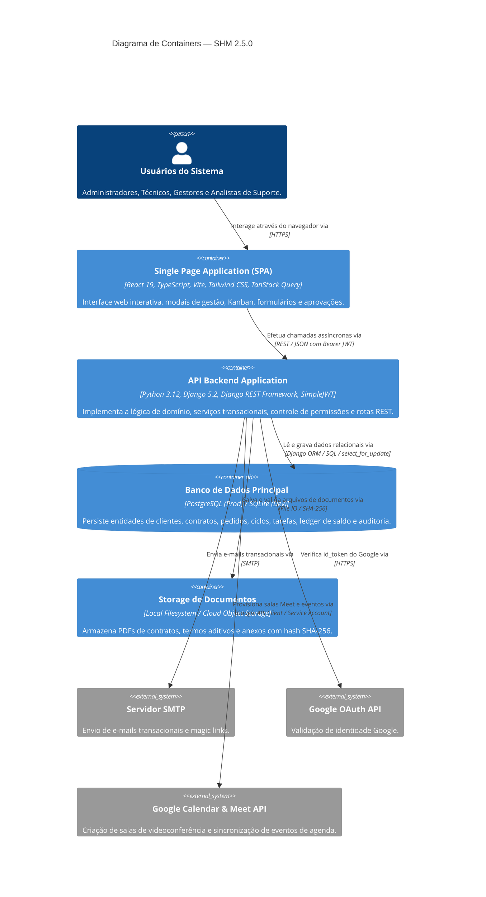

# Diagrama C4 — Containers (Nível 2)

```mermaid
C4Container
    title Diagrama de Containers — SHM 2.5.0

    Person(user, "Usuários do Sistema", "Administradores, Técnicos, Gestores e Analistas de Suporte.")

    Container(spa, "Single Page Application (SPA)", "React 19, TypeScript, Vite, Tailwind CSS, TanStack Query", "Interface web interativa, modais de gestão, Kanban, formulários e aprovações.")
    Container(api, "API Backend Application", "Python 3.12, Django 5.2, Django REST Framework, SimpleJWT", "Implementa a lógica de domínio, serviços transacionais, controle de permissões e rotas REST.")
    ContainerDb(db, "Banco de Dados Principal", "PostgreSQL (Prod) / SQLite (Dev)", "Persiste entidades de clientes, contratos, pedidos, ciclos, tarefas, ledger de saldo e auditoria.")
    Container(storage, "Storage de Documentos", "Local Filesystem / Cloud Object Storage", "Armazena PDFs de contratos, termos aditivos e anexos com hash SHA-256.")

    System_Ext(smtp, "Servidor SMTP", "Envio de e-mails transacionais e magic links.")
    System_Ext(google, "Google OAuth API", "Validação de identidade Google.")
    System_Ext(google_cal, "Google Calendar & Meet API", "Criação de salas de videoconferência e sincronização de eventos de agenda.")

    Rel(user, spa, "Interage através do navegador via", "HTTPS")
    Rel(spa, api, "Efetua chamadas assíncronas via", "REST / JSON com Bearer JWT")
    Rel(api, db, "Lê e grava dados relacionais via", "Django ORM / SQL / select_for_update")
    Rel(api, storage, "Salva e valida arquivos de documentos via", "File IO / SHA-256")
    Rel(api, smtp, "Envia e-mails transacionais via", "SMTP")
    Rel(api, google, "Verifica id_token do Google via", "HTTPS")
    Rel(api, google_cal, "Provisiona salas Meet e eventos via", "Google API Client / Service Account")
```

