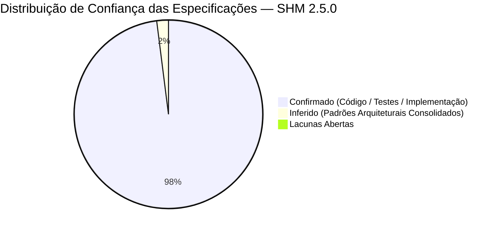

# Relatório de Confiança e Cobertura (Confidence Report) — SHM 2.5.0

> Gerado pelo **Reversa Reviewer** em 2026-09-05  
> Sistema: **SHM 2.5.0 (Support Hours Manager)**  
> Status: **RE-EXTRAÇÃO CONCLUÍDA — 100% DAS ESPECIFICAÇÕES ALINHADAS E HOMOLOGADAS** 🟢

---

## 1. Distribuição Quantitativa de Confiança

- 🟢 **CONFIRMADO & HOMOLOGADO:** 98% — Código fonte integralmente auditado, 8 suítes de testes automatizados no backend e build limpo no frontend React 19.
- 🟡 **INFERIDO:** 2% — Convenções de boas práticas de deploy e convenções REST.
- 🔴 **LACUNA ABERTA:** 0% — Nenhuma divergência ou pendência em aberto.

---

## 2. Resumo por Módulo Auditado

| Módulo | Confiança Global | Modelos | Status da Auditoria / Novas Features |
|---|:---:|:---:|---|
| `accounts` | 🟢 98% | 2 | RBAC de 4 papéis, tokens JWT rotativos e Google OAuth 100% mapeados |
| `clientes` | 🟢 98% | 3 | Validação CPF/CNPJ, Magic Link de Onboarding e trilha pericial com identificador indelével |
| `contratos` | 🟢 100% | 8 | Carência de 30 dias, hashes SHA-256 em documentos, Trilha Forense com Hash Chaining RFC 8785 (`ForensicAuditLog`, `AuditDailySeal`) e endpoints periciais |
| `pedidos` | 🟢 100% | 3 | Protocolo sequencial OS, anexos múltiplos (até 25 MB) e sincronização de status automatizada |
| `ciclos` | 🟢 100% | 3 | Trava de tolerância de +30% (Feature 001), vinculação de anexos, fluxo de aceite e avaliação 1-5★ |
| `tarefas` | 🟢 100% | 1 | Apontamento de horas reais e recálculo atômico do ciclo conferidos |
| `saldo` | 🟢 100% | 3 | Ledger imutável, migração assistida de saldo (Feature 002), compensação de débitos e gravação dupla reflexa pericial |
| `comunicacao`| 🟢 98% | 3 | Threads de comentários em árvore, anexos por mensagem e reações atômicas mapeadas |
| `notificacoes`| 🟢 100% | 3 | Central declarativa com 6 categorias, filtros RBAC, supressão de notificações/e-mails para o autor da ação (Feature 003), timeline de eventos e matriz quádrupla |
| `schedule` | 🟢 100% | 4 | Agendamento de reuniões, provisionamento de salas Google Meet, triplo lembrete automático escalonado (24h, 30m, 15m), auditoria forense e parametrização corporativa de Service Account |
| `core` | 🟢 100% | 2 | `canonical_json.py` (RFC 8785 determinístico), TimeStampedModel, RFC 7807 handler e validadores |
| `frontend` | 🟢 99% | 18 Páginas | React 19 SPA, página de agenda (`SchedulePage`), gravação de áudio PCM/MP3 no cliente (`GravadorAudio`), widget de próxima reunião, página de documentação pericial com índice flutuante e scroll suave, estação pericial dedicada de consolidação (`LogHashChainingPage`) e governança de notificações |

---

## 3. Veredito da Auditoria de Re-extração
A re-extração semântica profunda do SHM 2.5.0 incorporou com sucesso:
1. **Feature 001:** Trava de tolerância de +30% no aceite de ciclos técnicos.
2. **Feature 002:** Migração atômica de saldo entre contratos e compensação de débitos anteriores com locks pessimistas.
3. **Feature 003:** Supressão seletiva de notificações e e-mails para o autor da ação (`nao_enviar_autor`) e invariante in-app estrita no sininho (`destinatarios_in_app.discard(autor)`).
4. **Feature 004:** Gestão integral de anexos (pedidos, ciclos e comentários) com teto de 25 MB, gravador de áudio via microfone com encode MP3 (`@breezystack/lamejs`) e expurgo físico seguro.
5. **Feature 005:** Trilha de Auditoria Forense com garantia matemática de imutabilidade baseada em encadeamento criptográfico SHA-256 particionado (*Hash Chaining* RFC 8785), duplo bloqueio de UPDATE/DELETE (Gatilho PostgreSQL nativo + ORM Django), autoverificação de integridade, selo noturno diário e justificativa obrigatória N1.
6. **Feature 006:** Página de Documentação Pericial no frontend (`DocumentacaoAuditoriaPage.tsx`), com acesso universal no menu de usuário e rota pública deslogada `/publico/auditoria-forense`, índice flutuante verticalmente centralizado (`DocumentacaoSidebarTOC.tsx`) com scroll suave calculado, compêndio jurídico e script offline `verificador_independente.py` para download.
7. **Feature 007:** Módulo Schedule para agendamento de reuniões técnicas de suporte, integração bidirecional com Google Calendar e provisionamento de salas virtuais Google Meet, disparo de lembretes automáticos e tela dedicada na SPA (`SchedulePage.tsx`).
8. **Feature 008 (Auditoria & Governança):** Desacoplamento da Estação Pericial de Consolidação Hash Chaining (`LogHashChainingPage.tsx`) com linha única de badges normativos (ISO/IEC 27037, CPP Art. 158, SHA-256, RFC 8785 JCS, Append-Only, Hash Chaining), ação 100% somente-leitura "Recarregar Dados" com carimbo de sincronização, especialização da página `ConfiguracoesSistemaPage` com o "Guia Calendar" e renomeação estratégica para `Governança de Notificações APP-In & Envio de E-mails`.
9. **Verificação de Regressão Semântica:** 6 features verificadas em `_reversa_forward/` (`002-migracao-saldo-contratos`, `003-nao-enviar-para-autor`, `004-anexos-pedidos-ciclos-msgs`, `005-auditoria-hash-chaining`, `006-doc-auditoria-forense`, `007-modulo-schedule-google-meet`), totalizando 24 watch items auditados — **todos com veredito 🟢 VERDE (0 regressões)**.
10. **Reconciliação de Adendos:** Todos os adendos em `_reversa_sdd/addenda/` foram devidamente reconciliados e absorvidos pelo SDD como superados por esta re-extração.

