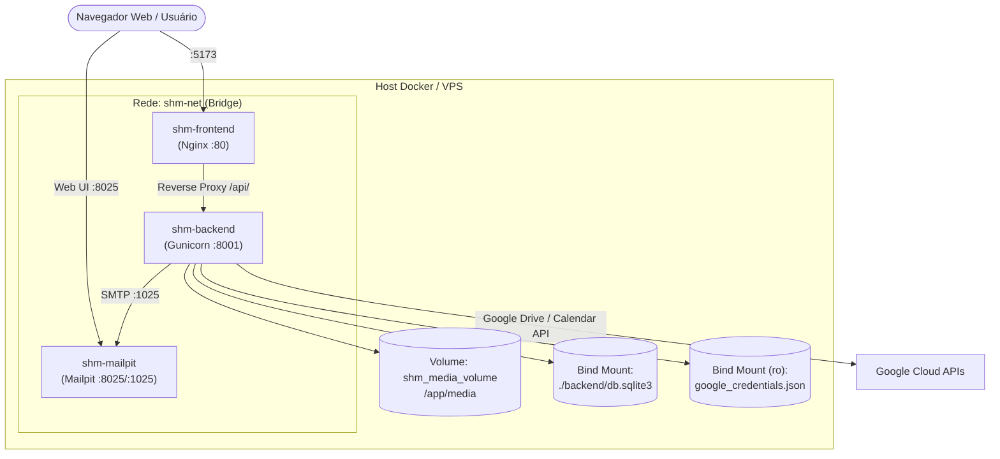

# Especificação de Infraestrutura e Deployment — SHM 2.6

> Gerado pelo **Reversa Architect** em 2026-10-08  
> Sistema: **SHM 2.6 (Support Hours Manager)**  
> Escala de Confiança: 🟢 CONFIRMADO | 🟡 INFERIDO | 🔴 LACUNA

---

## 1. Topologia de Ambientes

```
[Ambiente Local / Desenvolvimento (Linux / Bash)]
- Backend: Django dev server (Python 3.12+) rodando em http://localhost:8000
- Frontend: Vite dev server (Node 20+) rodando em http://localhost:5173
- Banco: SQLite3 local (backend/db.sqlite3)
- Servidor de E-mail: Mailpit (Docker port 1025 SMTP / 8025 WebUI) ou script dev_mail_server.py
- Orquestrador Local: Script dev.sh (Linux/Bash) e tools/database/reset_db.sh

[Ambiente Docker Compose (Containerizado)]
- Orquestrador: docker-compose.yml com rede dedicada shm-net (shm_network)
- Service `backend`: Python 3.12 Slim, Gunicorn 23.0 WSGI, porta 8001:8001, volume shm_media, entrypoint.sh (migrations automáticas)
- Service `frontend`: Node multi-stage build -> Nginx Alpine, porta 5173:80, reverse proxy e fallback SPA
- Service `mailpit`: Imagem axllent/mailpit:latest, portas 8025 (Web UI) e 1025 (SMTP)
- Volumes Persistentes: shm_media_volume (/app/media) e bind mount backend/db.sqlite3

[Ambiente de Produção / Cloud VPS]
- Backend: Gunicorn WSGI por trás de Nginx Reverse Proxy com terminação TLS/SSL
- Frontend: Nginx servindo build estático otimizado (SPA)
- Banco de Dados: PostgreSQL 16 com gatilhos de imutabilidade nativos C/PLpgSQL
- Storage Híbrido: VPS Local-First (/media/) espelhado assincronamente com Google Drive API (Service Account)
- Integrações Externas: Google Calendar/Meet API, Google OAuth 2.0 e SMTP Corporativo
```

---

## 2. Diagrama de Deployment em Contêineres (Mermaid)



---

## 3. Variáveis de Ambiente Críticas

| Variável | Contexto | Descrição |
|---|---|---|
| `SECRET_KEY` | Backend | Chave criptográfica Django |
| `DEBUG` | Backend | Flag de depuração (False em produção) |
| `ALLOWED_HOSTS` | Backend | Domínios permitidos |
| `DATABASE_URL` | Backend | URL de conexão PostgreSQL |
| `CORS_ALLOWED_ORIGINS` | Backend | Domínios frontend autorizados |
| `GOOGLE_CLIENT_ID` | Backend | Client ID do Google OAuth 2.0 |
| `GOOGLE_CREDENTIALS_FILE`| Backend | Caminho para JSON da Service Account Google |
| `GOOGLE_CALENDAR_ID` | Backend | ID da agenda Google Calendar corporativa |
| `EMAIL_HOST` / `EMAIL_PORT` | Backend | Configurações SMTP (localhost/mailpit) |
| `VITE_API_URL` | Frontend | Endpoint base da API REST backend |
