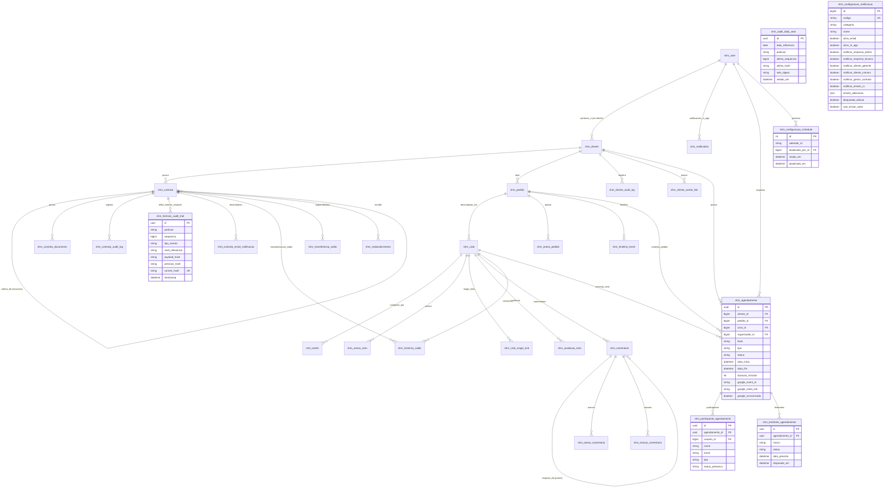

# Diagrama Entidade-Relacionamento Completo (ERD) — SHM 2.5.0

```mermaid
erDiagram
    shm_user ||--o{ shm_cliente : "pertence_a (se cliente)"
    shm_cliente ||--o{ shm_contrato : "possui"
    shm_cliente ||--o{ shm_pedido : "abre"
    shm_cliente ||--o{ shm_cliente_audit_log : "registra"
    shm_cliente ||--o{ shm_cliente_aceite_link : "possui"

    shm_contrato ||--o{ shm_contrato : "aditivo_de (recursivo)"
    shm_contrato ||--o{ shm_contrato_documento : "possui"
    shm_contrato ||--o{ shm_contrato_audit_log : "registra"
    shm_contrato ||--o{ shm_forensic_audit_trail : "trilha_forense_imutavel"
    shm_contrato ||--o{ shm_contrato_email_notificacao : "destinatarios"
    shm_contrato ||--o{ shm_historico_saldo : "movimentacoes_saldo"
    shm_contrato ||--o{ shm_transferencia_saldo : "origem/destino"
    shm_contrato ||--o{ shm_reabastecimento : "recebe"

    shm_pedido ||--o{ shm_ciclo : "decomposto_em"
    shm_pedido ||--o{ shm_anexo_pedido : "possui"
    shm_pedido ||--o{ shm_timeline_event : "timeline"

    shm_ciclo ||--o{ shm_tarefa : "composto_por"
    shm_ciclo ||--o{ shm_anexo_ciclo : "possui"
    shm_ciclo ||--o{ shm_ciclo_magic_link : "magic_links"
    shm_ciclo ||--o{ shm_avaliacao_ciclo : "avaliacao"
    shm_ciclo ||--o{ shm_comentario : "comentarios"
    shm_ciclo ||--o{ shm_historico_saldo : "consumos"

    shm_comentario ||--o{ shm_comentario : "resposta_de (parent)"
    shm_comentario ||--o{ shm_anexo_comentario : "anexos"
    shm_comentario ||--o{ shm_reacao_comentario : "reacoes"

    shm_user ||--o{ shm_notification : "notificacoes_in_app"

    shm_cliente ||--o{ shm_agendamento : "possui"
    shm_pedido ||--o{ shm_agendamento : "contexto_pedido"
    shm_ciclo ||--o{ shm_agendamento : "contexto_ciclo"
    shm_user ||--o{ shm_agendamento : "organiza"
    shm_agendamento ||--o{ shm_participante_agendamento : "participantes"
    shm_agendamento ||--o{ shm_lembrete_agendamento : "lembretes"

    shm_forensic_audit_trail {
        uuid id PK
        string particao
        bigint sequencia
        string tipo_evento
        string nivel_relevancia
        string payload_hash
        string previous_hash
        string current_hash UK
        datetime timestamp
    }

    shm_audit_daily_seal {
        uuid id PK
        date data_referencia
        string particao
        bigint ultima_sequencia
        string ultimo_hash
        string selo_digest
        datetime selado_em
    }

    shm_configuracao_notificacao {
        bigint id PK
        string codigo UK
        string categoria
        string nome
        boolean ativo_email
        boolean ativo_in_app
        boolean notificar_empresa_admin
        boolean notificar_empresa_tecnico
        boolean notificar_cliente_gerente
        boolean notificar_cliente_comum
        boolean notificar_gestor_contrato
        boolean notificar_emails_cc
        json emails_adicionais
        boolean bloqueado_edicao
        boolean nao_enviar_autor
    }

    shm_agendamento {
        uuid id PK
        bigint cliente_id FK
        bigint pedido_id FK
        bigint ciclo_id FK
        bigint organizador_id FK
        string titulo
        string tipo
        string status
        datetime data_inicio
        datetime data_fim
        int duracao_minutos
        string google_event_id
        string google_meet_link
        boolean google_sincronizado
    }

    shm_participante_agendamento {
        uuid id PK
        uuid agendamento_id FK
        bigint usuario_id FK
        string nome
        string email
        string tipo
        string status_presenca
    }

    shm_lembrete_agendamento {
        uuid id PK
        uuid agendamento_id FK
        string marco
        string status
        datetime data_prevista
        datetime disparado_em
    }

    shm_user ||--o{ shm_configuracao_schedule : "gerencia"

    shm_configuracao_schedule {
        int id PK
        string calendar_id
        bigint atualizado_por_id FK
        datetime criado_em
        datetime atualizado_em
    }
```

