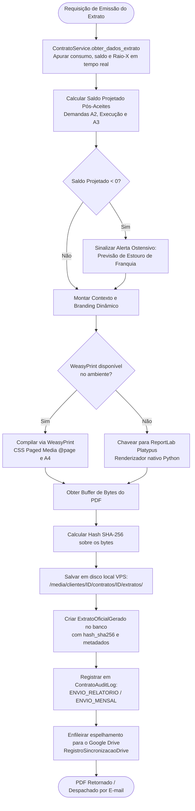

# Fluxograma: Emissão do Extrato Oficial de Contrato (Dual-Engine WeasyPrint / ReportLab)

```mermaid
flowchart TD
    Inicio([Requisição de Emissão do Extrato]) --> ObterDados[ContratoService.obter_dados_extrato<br/>Apurar consumo, saldo e Raio-X em tempo real]
    ObterDados --> CalcProj[Calcular Saldo Projetado Pós-Aceites<br/>Demandas A2, Execução e A3]
    CalcProj --> TesteEstouro{Saldo Projetado < 0?}
    TesteEstouro -- Sim --> AlertaEstouro[Sinalizar Alerta Ostensivo:<br/>Previsão de Estouro de Franquia]
    TesteEstouro -- Não --> MontarContexto[Montar Contexto e Branding Dinâmico]
    AlertaEstouro --> MontarContexto

    MontarContexto --> TesteEngine{WeasyPrint disponível<br/>no ambiente?}
    TesteEngine -- Sim --> CompilarWeasy[Compilar via WeasyPrint<br/>CSS Paged Media @page e A4]
    TesteEngine -- Não --> CompilarReportLab[Chavear para ReportLab Platypus<br/>Renderizador nativo Python]

    CompilarWeasy --> ObterBytes[Obter Buffer de Bytes do PDF]
    CompilarReportLab --> ObterBytes

    ObterBytes --> CalcHash[Calcular Hash SHA-256 sobre os bytes]
    CalcHash --> GravarDisco[Salvar em disco local VPS:<br/>/media/clientes/ID/contratos/ID/extratos/]
    GravarDisco --> CriarRegistro[Criar ExtratoOficialGerado no banco<br/>com hash_sha256 e metadados]
    CriarRegistro --> Auditar[Registrar em ContratoAuditLog:<br/>ENVIO_RELATORIO / ENVIO_MENSAL]
    Auditar --> DespachoDrive[Enfileirar espelhamento para o Google Drive<br/>RegistroSincronizacaoDrive]
    DespachoDrive --> Fim([PDF Retornado / Despachado por E-mail])
```
