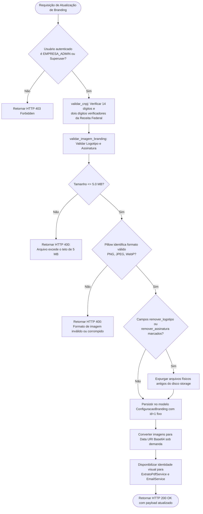

# Fluxograma: Gestão de Branding Corporativo (Singleton & Validação 5MB/CNPJ)

```mermaid
flowchart TD
    Requisicao([Requisição de Atualização de Branding]) --> AuthCheck{Usuário autenticado<br/>é EMPRESA_ADMIN ou Superuser?}
    AuthCheck -- Não --> Negado[Retornar HTTP 403 Forbidden]
    AuthCheck -- Sim --> ValidaCNPJ[validar_cnpj: Verificar 14 dígitos e<br/>dois dígitos verificadores da Receita Federal]
    
    ValidaCNPJ --> ValidaMidias[validar_imagem_branding: Validar Logotipo e Assinatura]
    ValidaMidias --> CheckSize{Tamanho <= 5.0 MB?}
    CheckSize -- Não --> ErroSize[Retornar HTTP 400:<br/>Arquivo excede o teto de 5 MB]
    CheckSize -- Sim --> CheckPillow{Pillow identifica formato válido<br/>PNG, JPEG, WebP?}
    CheckPillow -- Não --> ErroFormato[Retornar HTTP 400:<br/>Formato de imagem inválido ou corrompido]
    
    CheckPillow -- Sim --> CheckRemocao{Campos remover_logotipo ou<br/>remover_assinatura marcados?}
    CheckRemocao -- Sim --> ExcluirDisco[Expurgar arquivos físicos antigos do disco storage]
    CheckRemocao -- Não --> SingletonSave[Persistir no modelo ConfiguracaoBranding com id=1 fixo]
    ExcluirDisco --> SingletonSave

    SingletonSave --> Base64Helper[Converter imagens para Data URI Base64 sob demanda]
    Base64Helper --> InjetarServicos[Disponibilizar identidade visual para<br/>ExtratoPdfService e EmailService]
    InjetarServicos --> Sucesso([Retornar HTTP 200 OK com payload atualizado])
```
