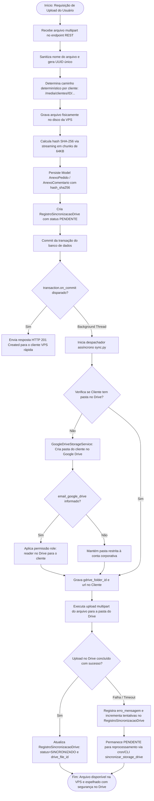
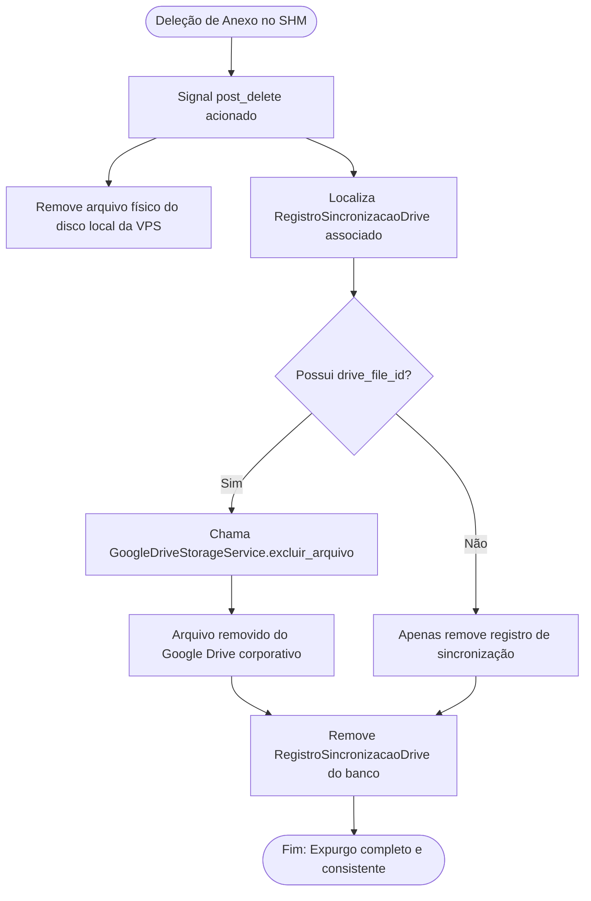

# Fluxograma de Função: Storage Híbrido VPS Local-First com Espelhamento Google Drive

> Módulo: `core` (submódulo `storage`)  
> Nível: `detalhado`  
> Rastreabilidade: `backend/apps/core/storage/` e `_reversa_forward/011-storage-hibrido-vps-drive/`

---

### Expurgo em Cascata (post_delete)

