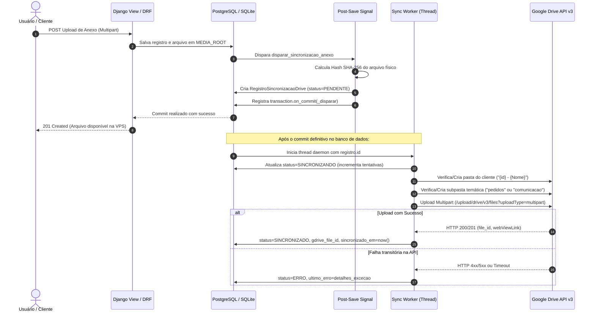
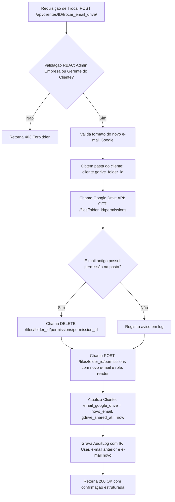

# Manual Técnico de Arquitetura e Administração: Google Drive Cloud Storage (5 TB)

> **Documento Técnico Oficial de Engenharia e Operação Forense**  
> **Público-Alvo:** Administradores de Infraestrutura, Engenheiros de Software e DevOps  
> **Sistema:** SHM (Sistema Homologado de Manutenção e Suporte)  
> **Nível de Acesso:** Exclusivo Administradores (`is_empresa`, `is_superuser`)

---

## 1. Topologia de Armazenamento Híbrido (*Dual-Storage Architecture*)

O SHM Cloud Storage implementa uma topologia híbrida de duas camadas que desacopla a camada de entrega rápida da camada de arquivamento perene e compliance documental.

```
+-------------------------------------------------------------------------------+
|                       CAMADA 1: STORAGE PRIMÁRIO (VPS)                        |
|                                                                               |
|  - Caminho: settings.MEDIA_ROOT (ex: /var/www/shm/backend/media/)             |
|  - Função: Leitura e escrita síncrona de baixíssima latência (SSD local)      |
|  - Formato de caminhos:                                                       |
|      clientes/{cliente_id}/pedidos/{pedido_id}/{ano}/{arquivo}                |
|      clientes/{cliente_id}/ciclos/{ciclo_id}/{ano}/{arquivo}                  |
|  - Cálculo imediato de Hash Forense: SHA-256 (FIPS 180-4)                     |
+---------------------------------------+---------------------------------------+
                                        |
                 Disparo Assíncrono     |  transaction.on_commit
                 (Background Worker)    v  Daemon Thread Pool
+-------------------------------------------------------------------------------+
|                   CAMADA 2: STORAGE CORPORATIVO (GOOGLE DRIVE)                |
|                                                                               |
|  - Cota Alocada: 5 Terabytes (Google One / Google Workspace Corporativo)      |
|  - Autenticação Principal: OAuth 2.0 User Credentials (proj.eng.sw@gmail.com)  |
|  - Fallback Automático: Google Cloud Service Account (JWT Token)              |
|  - Protocolo: Google Drive REST API v3 (Upload Multipart com Resilient Retry) |
|  - Estrutura de Diretórios na Nuvem:                                          |
|      [Raiz: SHM-Storage]                                                      |
|         └── {cliente_id} - {nome_cliente}/                                    |
|               ├── pedidos/                                                    |
|               └── comunicacao/                                                |
+-------------------------------------------------------------------------------+
```

---

## 2. Ciclo de Vida do Anexo e Pipeline de Sincronização

A persistência de anexos segue rigorosamente um pipeline baseado em eventos atômicos para assegurar consistência entre o banco de dados relacional e a nuvem corporativa:



### Garantias do Pipeline:
1. **Não Bloqueante:** A requisição HTTP do usuário responde instantaneamente; a transferência pesada de bytes para o Google Drive ocorre em segundo plano.
2. **Idempotência:** Arquivos com o mesmo hash e mesmo ID de origem não são duplicados.
3. **Auditoria Forense:** Cada arquivo espelhado armazena seu `hash_sha256`, `tamanho_bytes`, `gdrive_file_id` e link direto no modelo `RegistroSincronizacaoDrive`.

---

## 3. Modelo de Permissões e Segurança (Google Drive ACL)

A governança de acessos no Google Drive baseia-se no **Princípio do Menor Privilégio** e isolamento absoluto de *tenants*:

| Entidade | Nível de Acesso no Drive | Tipo (`type`) | Descrição |
| :--- | :--- | :--- | :--- |
| **Conta Corporativa SHM** (`proj.eng.sw@gmail.com`) | `role: owner` | `user` | Proprietária da pasta raiz `SHM-Storage` e de todos os arquivos. Controla a cota de 5 TB. |
| **Conta de Gestão / Admin** (`andresouza72br@gmail.com`) | `role: reader` / `writer` | `user` | Acesso de supervisão operacional sobre as pastas do sistema. |
| **Conta Google do Cliente** (`email_google_drive`) | `role: reader` | `user` | Permissão estrita de leitor sobre **apenas a sua própria pasta** (`{id} - {Nome}`). |
| **Público / Qualquer com Link** | ❌ **PROIBIDO** | `anyone` | Bloqueado por arquitetura. Nenhuma permissão com `type: anyone` é jamais criada. |

---

## 4. Procedimento Seguro de Troca de E-mail Google do Cliente

Quando o cliente substitui o e-mail cadastrado para acesso aos seus arquivos no Drive (seja por mudança de quadro de funcionários ou migração para domínio corporativo), o SHM deve executar a transição de forma atômica e auditada.

### Fluxo Técnico Executado pelo Serviço:



### Chamadas de API Realizadas:
1. **Recuperação das permissões atuais:**
   ```http
   GET https://www.googleapis.com/drive/v3/files/{folder_id}/permissions?fields=permissions(id,type,role,emailAddress)
   Authorization: Bearer {access_token}
   ```
2. **Revogação do e-mail desvinculado:**
   ```http
   DELETE https://www.googleapis.com/drive/v3/files/{folder_id}/permissions/{permission_id}
   Authorization: Bearer {access_token}
   ```
3. **Concessão para o novo e-mail:**
   ```http
   POST https://www.googleapis.com/drive/v3/files/{folder_id}/permissions?sendNotificationEmail=false
   Authorization: Bearer {access_token}
   Content-Type: application/json

   {
     "role": "reader",
     "type": "user",
     "emailAddress": "novo.email@gmail.com"
   }
   ```

---

## 5. Procedimento de Troca da Conta Corporativa do SHM (5 TB)

Se a organização migrar a conta mantenedora do armazenamento Google Drive (por exemplo, de `proj.eng.sw@gmail.com` para `storage@empresa.com.br` ou para um novo Google Workspace corporativo), o administrador do sistema deve seguir o procedimento operacional padronizado abaixo.

### ⚠️ Cenários de Migração da Conta Corporativa:

#### Cenário A: Preservação da Estrutura Atual via Transferência de Posse (Recomendado)
Se as duas contas forem do mesmo domínio Google Workspace ou se o Google permitir compartilhamento direto:
1. A conta antiga compartilha a pasta raiz `SHM-Storage` com a nova conta corporativa com permissão **Organizador / Editor**.
2. No console do Google Drive, transfere a propriedade das pastas para a nova conta.
3. Roda a autorização OAuth no SHM com a nova conta.

#### Cenário B: Criação de Nova Raiz e Sincronização Delta a partir da VPS (Mais Seguro e Limpo)
Como o SHM possui a totalidade dos arquivos físicos íntegros na VPS local, a infraestrutura permite recriar 100% da nuvem em uma nova conta Google a qualquer momento, sem depender do estado da conta antiga:

```
PASSO 1: Obter credenciais OAuth 2.0 da nova conta no Google Cloud Console
   - Criar Projeto ou usar existente
   - Criar credencial OAuth 2.0 (Desktop/Web)
   - Baixar client_secret.json ou configurar variáveis no .env

PASSO 2: Iniciar autorização no terminal da VPS
   python manage.py autorizar_google_drive

PASSO 3: Autorizar no navegador com a nova conta Google
   - O comando captura o Refresh Token de 5 TB e grava no .env
   - Atualiza GOOGLE_DRIVE_USER_EMAIL no .env

PASSO 4: Limpar o cache de ID da pasta raiz
   - Definir GOOGLE_DRIVE_ROOT_FOLDER_ID="" no .env (ou nova pasta)
   - Na primeira sincronização, o SHM criará a nova pasta "SHM-Storage" na nova conta

PASSO 5: Executar a Sincronização em Lote de Todo o Acervo
   python manage.py sincronizar_storage_drive --forcar

PASSO 6: Auditar Permissões de Todas as Pastas de Clientes
   python manage.py gerenciar_storage_drive --auditar-permissoes
```

---

## 6. Guia Completo de Comandos Administrativos (CLI)

O SHM disponibiliza ferramentas via `manage.py` para todas as tarefas de governança do storage:

### 1. Diagnóstico e Auditoria de Permissões
```bash
# Diagnóstico completo da conexão, cota e contas ativas
python manage.py gerenciar_storage_drive --diagnostico

# Varredura de integridade: confere permissões ativas em todas as pastas de clientes
python manage.py gerenciar_storage_drive --auditar-permissoes
```

### 2. Troca Segura de E-mail de Cliente via Terminal
```bash
python manage.py gerenciar_storage_drive --trocar-email-cliente --cliente-id 2 --novo-email novo.gestor@gmail.com
```

### 3. Sincronização de Anexos em Lote
```bash
# Varre e sincroniza apenas anexos com status de ERRO ou PENDENTE
python manage.py sincronizar_storage_drive --apenas-erros

# Sincroniza arquivos pendentes de um cliente específico
python manage.py sincronizar_storage_drive --cliente-id 2

# Força o re-envio de todos os arquivos físicos locais para a nuvem
python manage.py sincronizar_storage_drive --forcar
```

### 4. Autorização e Renovação OAuth 2.0
```bash
# Inicia servidor local na porta 8080 para troca de Refresh Token
python manage.py autorizar_google_drive --porta 8080
```

---

## 7. Matriz de Tratamento de Erros da Google Drive API

| Código HTTP | Causa Raiz | Comportamento do SHM | Ação Corretiva do Administrador |
| :--- | :--- | :--- | :--- |
| **401 Unauthorized** | Token de acesso expirado ou Refresh Token revogado. | O serviço tenta auto-refresh com o Refresh Token. Se falhar, registra erro no log. | Rodar `python manage.py autorizar_google_drive` para obter novo Refresh Token. |
| **403 rateLimitExceeded** | Excedido o limite de requisições por segundo da Google API. | O worker aplica *exponential backoff* e re-tenta após alguns segundos. | Verificar se há múltiplas instâncias em lote concorrentes. |
| **403 userRateLimitExceeded** | Limite de cota diária de upload (750 GB/dia por usuário do Google). | Sincronização pausa o upload do arquivo e marca como `PENDENTE`. | Aguardar a janela de 24h da Google ou escalonar uploads em lote. |
| **404 fileNotFound** | A pasta do cliente ou subpasta foi excluída manualmente no Drive. | O serviço limpa o ID salvo e recria automaticamente a pasta correspondente. | Evitar manipular a árvore de pastas diretamente pela interface web do Drive. |
| **400 alreadyExists** | Permissão concedida já existia previamente no Google Drive. | O SHM trata como sucesso idempotente sem falha. | Nenhuma ação requerida. |

---

## 8. Variáveis de Ambiente Críticas (.env)

| Variável | Descrição | Exemplo de Valor |
| :--- | :--- | :--- |
| `GOOGLE_DRIVE_ROOT_FOLDER` | Nome da pasta raiz no Drive corporativo | `SHM-Storage` |
| `GOOGLE_DRIVE_ROOT_FOLDER_ID` | ID do Drive da pasta raiz corporativa | `17MI9diA50sgTW6SWho5LAgjWeE-fKqGO` |
| `GOOGLE_DRIVE_USER_EMAIL` | Conta Google dona do armazenamento corporativo | `proj.eng.sw@gmail.com` |
| `GOOGLE_DRIVE_OAUTH_CLIENT_ID` | Client ID OAuth 2.0 para acesso ao Drive | `770138983697-*.apps.googleusercontent.com` |
| `GOOGLE_DRIVE_OAUTH_CLIENT_SECRET` | Client Secret OAuth 2.0 do Google Cloud | `GOCSPX-*` |
| `GOOGLE_DRIVE_REFRESH_TOKEN` | Refresh Token permanente para renovação automática | `1//0hLYLR...` |
| `GOOGLE_SERVICE_ACCOUNT_FILE` | Caminho relativo do JSON da Service Account (Fallback) | `config/google_credentials.json` |
